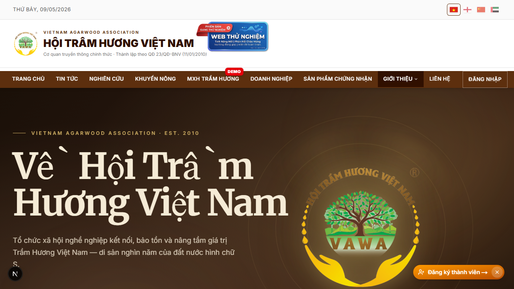
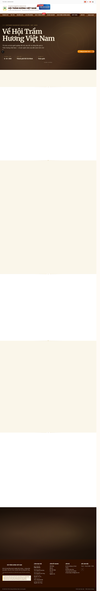
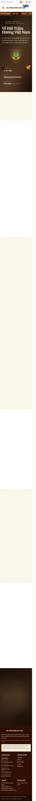
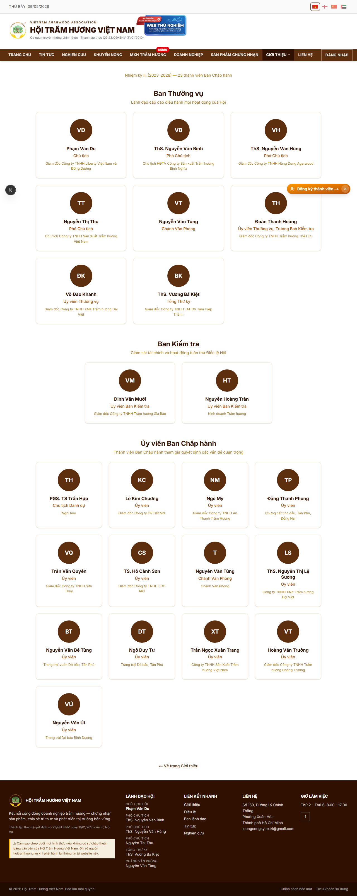
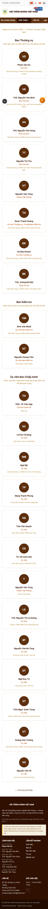

# 02. Trang Giới thiệu

## Mục đích
Giới thiệu về Hội Trầm Hương Việt Nam (VAWA): lịch sử, sứ mệnh, ban lãnh đạo, hội viên tiêu biểu.

## Đối tượng
- Khách (chưa đăng nhập)
- Hội viên / Admin

## Đường dẫn
- URL: `/gioi-thieu-v2` *(route chính thức trong code; menu hiển thị nhãn "Giới thiệu")*
- Public, không cần đăng nhập.

## Bố cục
1. **Hero** — banner gradient nâu + animation chữ "Về Hội Trầm Hương Việt Nam" + logo VAWA xoay nhẹ.
2. **Lịch sử & sứ mệnh** — số liệu nổi bật (năm thành lập 2010, tổng số hội viên).
3. **Ban Thường vụ (BTV)** — 7 người, có thể chuyển tab xem nhiệm kỳ trước.
4. **Hội viên tiêu biểu** — scroll ngang các Hội viên có `role` ∈ `VIP/INFINITE`, sắp xếp theo `contributionTotal` rồi `displayPriority`.
5. **CTA "Xem toàn bộ Ban lãnh đạo"** — link sang `/ban-lanh-dao` để xem đủ 3 ban (BTV + BCH + BKT).

## Các điểm cần lưu ý
- Trang được cache **10 phút** (`revalidate = 600`). Khi admin sửa hồ sơ ban lãnh đạo, cache sẽ tự revalidate qua tag `gioi-thieu`/`leaders`.
- Thông tin ban lãnh đạo do admin nhập tại `/admin/ban-lanh-dao` (xem tài liệu mục Admin).
- Có chèn structured data `Organization` JSON-LD đầy đủ (địa chỉ, điện thoại Chủ tịch + Phó Chủ tịch, email lấy từ SiteConfig key `association_email`).
- Đa ngôn ngữ: tên, chức danh, tiểu sử của lãnh đạo có 4 phiên bản VI/EN/中文/العربية, hiển thị theo locale hiện tại.

## Trang Ban lãnh đạo đầy đủ (`/ban-lanh-dao`)
Tách trang riêng để hiển thị **đủ 3 ban**:
- **BTV** — Ban Thường vụ (7 người)
- **BCH** — Ủy viên Ban Chấp hành
- **BKT** — Ban Kiểm tra

Có **bộ lọc nhiệm kỳ** ở đầu trang để xem ban lãnh đạo của các nhiệm kỳ trước.

## Hình ảnh minh họa

**Trang Giới thiệu — Hero (desktop)**

**Trang Giới thiệu — toàn trang**

**Trang Giới thiệu — mobile**

**Trang Ban lãnh đạo đầy đủ (`/ban-lanh-dao`)**

**Ban lãnh đạo — mobile**

