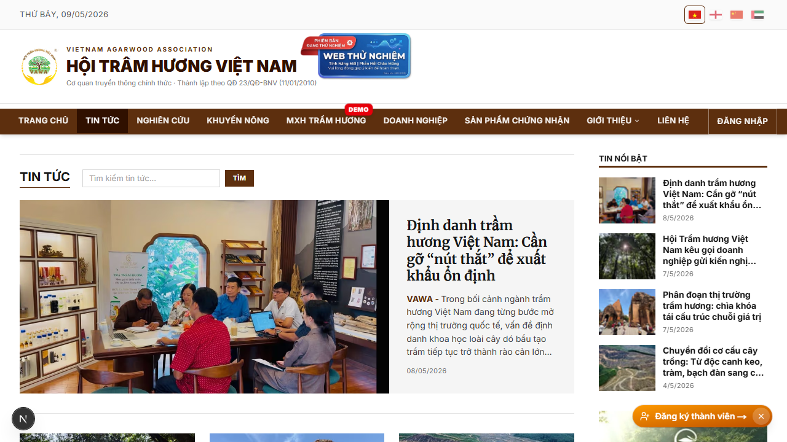
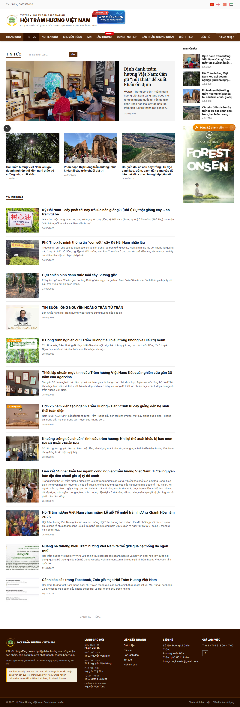
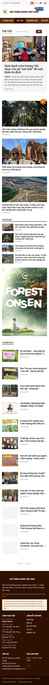
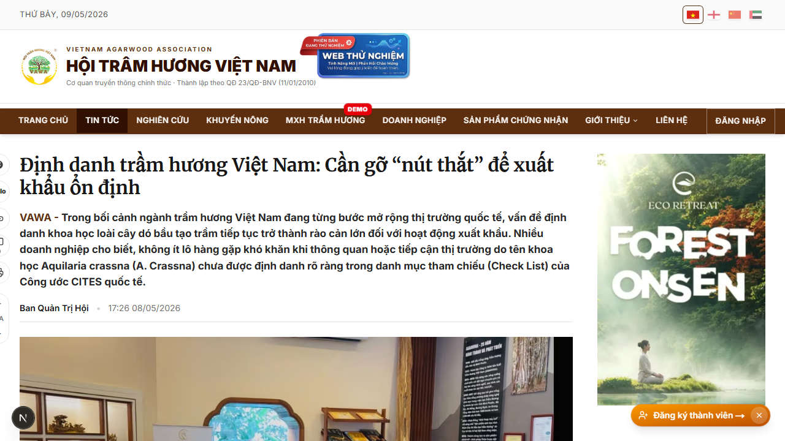
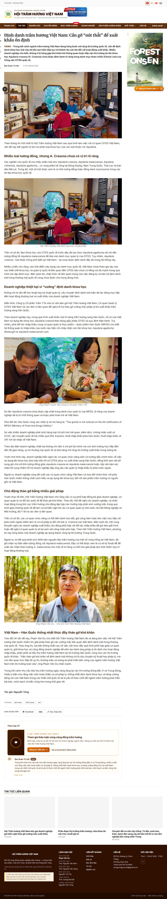

# 04. Tin tức — danh sách + chi tiết

## Mục đích
Đăng tải tin tức của Hội. Bao gồm 2 trang:
- **Danh sách** (`/tin-tuc`) — gallery các bài tin tức đã xuất bản.
- **Chi tiết** (`/tin-tuc/[slug]`) — nội dung đầy đủ một bài.

## Đối tượng
- Public — ai cũng đọc được.

## Đường dẫn
- Danh sách: `/tin-tuc`
- Chi tiết: `/tin-tuc/<slug>` (slug auto-generate từ tiêu đề khi admin đăng).

## Trang danh sách (`/tin-tuc`)

### Bố cục
1. **Hero bài đầu tiên** (image-left 2/3 + text-panel-right 1/3, bg neutral-100) — bài mới nhất / pinned.
2. **3 bài phụ** dạng grid 3 cột phía dưới hero (border-top divider).
3. **Cột chính (col-9) + Sidebar (col-3)**:
   - Cột chính: danh sách bài còn lại, **lazy-load 10 bài/lần** khi cuộn (IntersectionObserver, rootMargin 200px).
   - Sidebar: "Tin nổi bật" + "Mới đăng" (cache 10 phút).
4. **KHÔNG dùng pagination URL** — tất cả lazy-load infinite scroll.

### Hành vi
- Bài có `isPinned = true` luôn lên đầu, sau đó sort theo `publishedAt` desc.
- Bài có `publishedAt = null` (chưa định ngày xuất bản) **không** chiếm ô hero — chỉ rơi vào danh sách Latest.

## Trang chi tiết (`/tin-tuc/[slug]`)

### Bố cục
- **H1** dùng font Merriweather serif (class `.font-serif-headline`), phong cách báo VTV.
- **Sapo** in đậm, prefix tự thêm `"VAWA - "` (không in nghiêng).
- **2-col grid**: nội dung chính (col-9) + sidebar dính (sticky col-3) "Tin nổi bật" + "Mới đăng".
- **ArticleToolbar** dọc bên trái (≥ xl): nút Share / Comment / Print / Zoom font.

### Tính năng
- Render HTML đã được sanitize sẵn ở server (không ship DOMPurify ra client).
- Bao gồm gallery (nếu có) — TipTap rich content.
- JSON-LD `NewsArticle` chuẩn schema.org → pass Rich Results Test.

## Lưu ý
- Trang danh sách cache **5 phút** (`revalidate = 300`), search bypass cache.
- Bài viết do admin đăng tại `/admin/tin-tuc`. Có thể đăng kèm cover image (Cloudinary), gallery, video YouTube embed.
- Nếu cover null, sidebar có **fallback thumbnail**: lấy YouTube thumb hoặc gallery[0].
- Bài "ghim" (`isPinned`) **tự bỏ ghim sau 2 ngày** (cron job — feat từ commit `ccc3349`).

## Hình ảnh minh họa

**Trang danh sách — đầu trang (desktop)**

**Trang danh sách — toàn trang**

**Trang danh sách — mobile**

**Trang chi tiết — đầu bài**

**Trang chi tiết — toàn trang**

