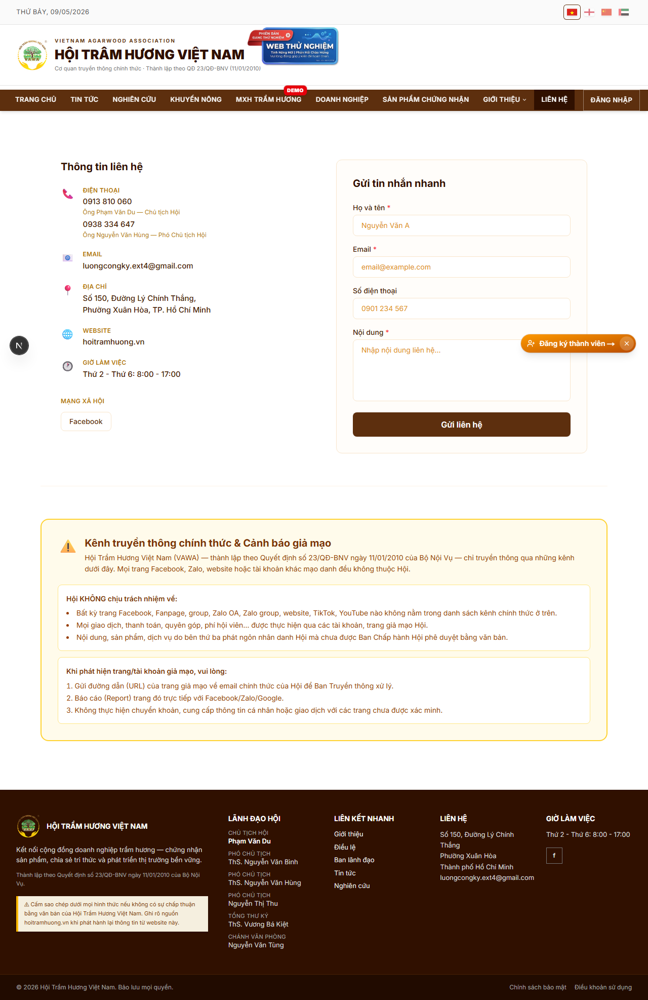
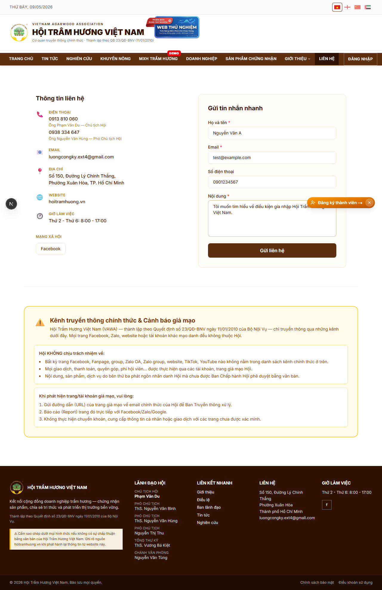
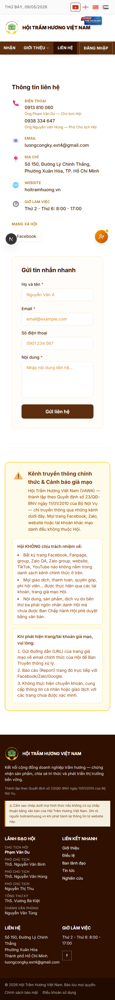

# 05. Liên hệ

## Mục đích
Cho khách / hội viên gửi tin nhắn liên hệ tới Hội qua form. Tin nhắn được:
1. **Lưu vào CSDL** (`ContactMessage`) — nguồn dữ liệu chính.
2. **Gửi email tới hộp thư Hội** — kênh thông báo phụ.

## Đối tượng
- Public.

## Đường dẫn
- URL: `/lien-he`
- Liên kết từ menu chính (mục cuối) và footer.

## Bố cục
1. **Thông tin liên hệ** (header) — địa chỉ, số điện thoại Chủ tịch / Phó Chủ tịch, email Hội, fanpage.
2. **Form gửi liên hệ** (4 trường):
   - Họ tên (bắt buộc)
   - Email (bắt buộc, validate đúng format)
   - Số điện thoại (tùy chọn)
   - Nội dung (bắt buộc)
3. **Nút "Gửi liên hệ"**.
4. **Bản đồ** (Google Maps embed của trụ sở Hội) — tùy theo cấu hình.

## Quy trình gửi
1. Người dùng điền form và nhấn **Gửi liên hệ**.
2. Form validate ngay trên client (email pattern, các field bắt buộc).
3. Gửi `POST /api/contact` → server lưu vào bảng `ContactMessage`.
4. Server gửi email **TỚI hộp thư Hội** (`hoitramhuongvietnam2010@gmail.com` mặc định, override qua env `CONTACT_INBOX_EMAIL`):
   - From: `Hội Trầm Hương Việt Nam <noreply@hoitramhuong.vn>`
   - Reply-To: email của người gửi (admin chỉ cần Reply trên Gmail là phản hồi đúng người)
   - Subject: `[Liên hệ website] <Họ tên>`
5. Nếu email lỗi (Resend down, inbox full…), **request vẫn thành công** — vì DB đã lưu, admin sẽ thấy ở `/admin/lien-he` và badge thông báo.
6. Form chuyển sang trạng thái **"✅ Cảm ơn — đã gửi liên hệ"** kèm nút "Gửi liên hệ khác".

## Quy tắc validate
- Họ tên: tối đa 200 ký tự.
- Email: đúng pattern `[^\s@]+@[^\s@]+\.[^\s@]+`, tối đa 200 ký tự.
- Nội dung: tối đa 5000 ký tự.
- Thiếu họ tên / email / nội dung → form từ chối với lỗi tương ứng.

## Quản trị
- Admin xem các tin nhắn liên hệ tại `/admin/lien-he` (bảng + đánh dấu đã đọc / xử lý).
- Có badge thông báo trên admin dashboard cho tin nhắn chưa đọc.

## Lưu ý
- Form đa ngôn ngữ — hiển thị placeholder + thông báo lỗi theo locale.
- KHÔNG có CAPTCHA hiện tại (vì DB persist + admin lọc thủ công). Có thể bổ sung sau nếu spam.

## Hình ảnh minh họa

**Form Liên hệ — trống (desktop)**

**Form Liên hệ — đã điền sẵn**

**Form Liên hệ — mobile**

