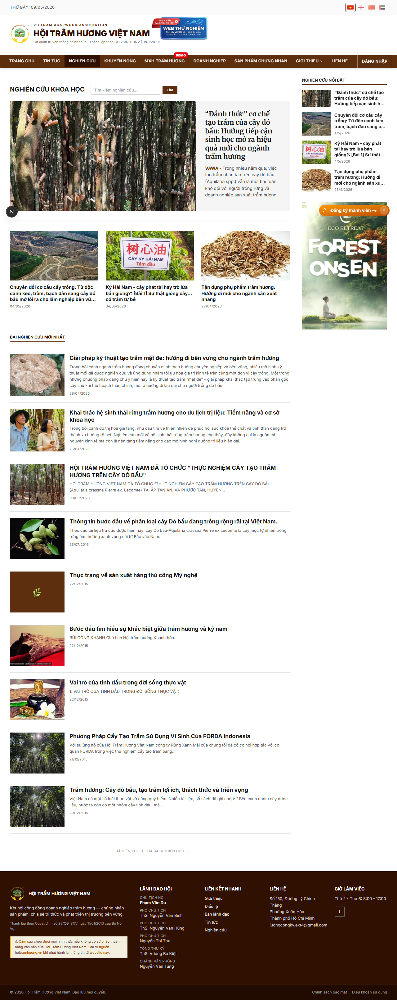
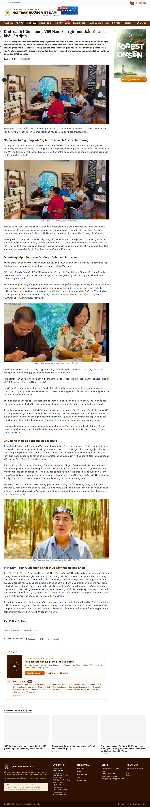
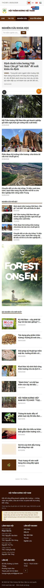
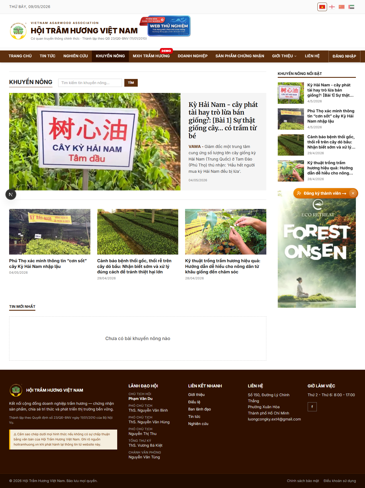
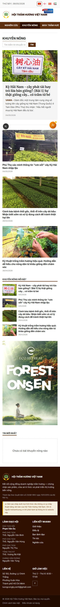

# 33. Nghiên cứu khoa học + Khuyến nông

## Mục đích
2 chuyên mục nội dung công khai phục vụ cộng đồng trầm hương:
- **Nghiên cứu** — bài nghiên cứu khoa học, công bố học thuật, tài liệu kỹ thuật.
- **Khuyến nông** — hướng dẫn kỹ thuật trồng, chăm sóc, thu hoạch trầm hương cho nông dân.

Cả 2 dùng chung schema `News` với `category` khác nhau, nhưng có **trang list + trang chi tiết riêng** để tăng tính chuyên đề.

## Đối tượng
- Public — đọc.
- Admin (Ban Truyền thông + Ban Thư ký) — đăng / sửa qua `/admin/tin-tuc` (chọn category tương ứng).

## Đường dẫn
- Nghiên cứu list: `/nghien-cuu`
- Nghiên cứu chi tiết: `/nghien-cuu/<slug>`
- Khuyến nông list: `/khuyen-nong`
- Khuyến nông chi tiết: `/khuyen-nong/<slug>`

Liên kết từ menu chính: **Nghiên cứu** + **Khuyến nông** (2 menu items riêng).

## Bố cục — Trang list

Cả 2 trang dùng **cùng pattern editorial** với trang `/tin-tuc`:
1. **Hero** — bài đầu (image-left 2/3 + text-panel-right 1/3).
2. **3 sub-hero grid** — 3 bài tiếp theo, divider border-top.
3. **2-col layout (col-9 + col-3)**:
   - Cột chính: list bài còn lại, lazy-load 10/lần qua IntersectionObserver.
   - Sidebar: "Tin nổi bật" + "Mới đăng" (cache 10 phút).

### Khác biệt nội dung
- **Nghiên cứu**: tone học thuật — sapo dài hơn, thường có abstract; body nhiều biểu đồ / công thức.
- **Khuyến nông**: tone hướng dẫn — step-by-step, kèm video YouTube embed cho thao tác.

## Bố cục — Trang chi tiết

Cùng template như trang `/tin-tuc/[slug]`:
- **H1** Merriweather serif.
- **Sapo** in đậm prefix `"VAWA - "`.
- **2-col grid** (col-9 body + col-3 sticky sidebar).
- **ArticleToolbar** dọc bên trái (≥ xl) — share / comment / print / zoom.
- **SidebarList** shared — Tin nổi bật + Mới đăng của cùng category.

### Cross-link giữa các category
Sidebar có thể hiện cross-link sang các category khác (vd trang Nghiên cứu sidebar có cả tin tức Hội liên quan).

## Quản trị nội dung
Cả 2 chuyên mục đều admin tại `/admin/tin-tuc` — chọn:
- `category = NGHIEN_CUU` cho bài nghiên cứu.
- `category = KHUYEN_NONG` cho bài khuyến nông.
- Có thể tick `secondaryCategories` để bài xuất hiện ở **nhiều mục** (vd 1 bài vừa nghiên cứu vừa khuyến nông kỹ thuật).

## Cache & SEO
- List page: cache **5 phút** (`revalidate = 300`).
- Detail page: cache **10 phút** (`revalidate = 600`).
- Mỗi bài chèn JSON-LD `Article` (NEWS_TYPE) + `BreadcrumbList`.
- Sitemap động bao gồm tất cả slug.

## Hình ảnh minh họa

**Nghiên cứu khoa học — list**

**Nghiên cứu — chi tiết**

**Nghiên cứu — mobile**

**Khuyến nông — list**

**Khuyến nông — mobile**

