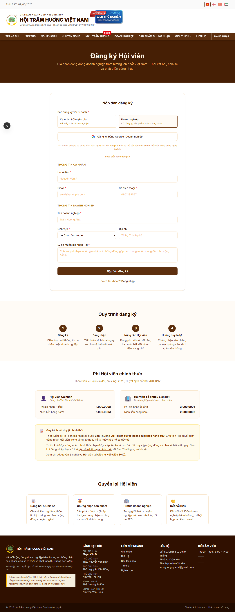
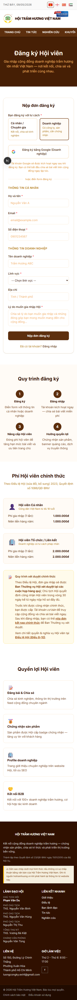

# 06. Đăng ký + Email chào mừng

## Mục đích
Cho phép cá nhân / doanh nghiệp tự nộp đơn đăng ký gia nhập Hội qua website. Đơn được lưu vào CSDL, gửi email thông báo cho admin và email **xác nhận đã nhận đơn** cho người đăng ký.

## Đối tượng
- Khách (chưa đăng nhập).

## Đường dẫn
- URL: `/dang-ky`
- Liên kết: nút **"Đăng ký hội viên"** ở banner CTA cuối trang chủ; link **"Chưa có tài khoản? Đăng ký hội viên"** ở trang đăng nhập; menu auth của khách.

## Hai loại tài khoản
Người dùng chọn **một trong hai** ở đầu form:
1. **Cá nhân / Chuyên gia** (`INDIVIDUAL`) — nhà nghiên cứu, chuyên viên, người yêu trầm hương; KHÔNG cần thông tin doanh nghiệp.
2. **Doanh nghiệp** (`BUSINESS`) — chủ doanh nghiệp; cần điền tên doanh nghiệp + lĩnh vực.

## Các trường bắt buộc

| Trường | Cá nhân | Doanh nghiệp | Validate |
|---|---|---|---|
| Họ tên | ✅ | ✅ | ≥ 2 ký tự |
| Email | ✅ | ✅ | đúng format, chưa tồn tại trong hệ thống |
| Số điện thoại | ✅ | ✅ | `0xxxxxxxxx` hoặc `+84xxxxxxxxx` (8–9 số đuôi) |
| Tên doanh nghiệp | — | ✅ | ≥ 2 ký tự |
| Lĩnh vực | — | ✅ | chọn từ danh sách dựng sẵn |
| Địa chỉ / Chuyên môn | tùy chọn | tùy chọn | text tự do |
| Lý do đăng ký | ✅ | ✅ | ≥ 10 ký tự |

## Quy trình
1. Khách điền form → nhấn **"Đăng ký"**.
2. Server validate (Zod schema) + check email **chưa tồn tại**. Nếu trùng → trả lỗi `409`.
3. Tạo bản ghi `User` với:
   - `role = "GUEST"` (Tài khoản cơ bản, chưa phải Hội viên)
   - `isActive = false` (chưa thể đăng nhập)
   - `accountType = "BUSINESS"` hoặc `"INDIVIDUAL"`
   - Nếu là `BUSINESS`: tạo kèm bản ghi `Company` (chưa publish, chưa verified).
4. **Gửi email cho admin** (đến `association_email` trong SiteConfig, fallback `admin@hoitramhuong.vn`):
   - Subject: `[Đăng ký mới] <Họ tên> — <Doanh nghiệp>` *(hoặc "Cá nhân")*
   - Kèm nút **"Xem đơn đăng ký"** dẫn tới `/admin/hoi-vien?status=pending`.
5. **Gửi email xác nhận cho người đăng ký**:
   - Subject: `Đã nhận đơn đăng ký — Hội Trầm Hương Việt Nam`
   - Nội dung: cảm ơn đã đăng ký, hẹn 1–2 ngày làm việc sẽ phản hồi, sẽ gửi link đặt mật khẩu khi được duyệt.
6. Hiển thị trang **"✅ Đã gửi đơn đăng ký"** với hướng dẫn chờ email.

## Sau khi đăng ký
- **KHÔNG đăng nhập được ngay** vì `isActive = false`.
- Admin xem đơn ở `/admin/hoi-vien?status=pending` và **Approve** hoặc **Reject**.
- Khi admin approve → hệ thống gửi email **kèm liên kết đặt mật khẩu** (token 48h) → user click → đặt mật khẩu → `isActive = true` → đăng nhập được.

## Anti-bot
- Form có **honeypot field** ẩn (CSS hidden, không người dùng nào nhìn thấy). Nếu bị bot điền, server **silently** trả `success: true` mà không tạo user → bot không phân biệt được.

## Lưu ý
- Email Google của user sau này vẫn dùng được nếu khớp email đã đăng ký (NextAuth Google provider).
- Đơn đăng ký được liệt kê ở admin dashboard với badge số đơn chưa duyệt.

## Hình ảnh minh họa

**Form đăng ký — desktop**

**Form đăng ký — mobile**

