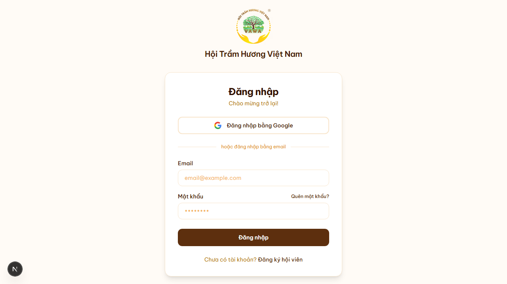
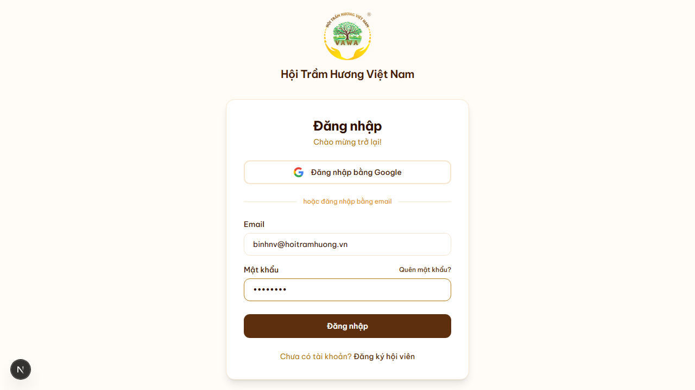
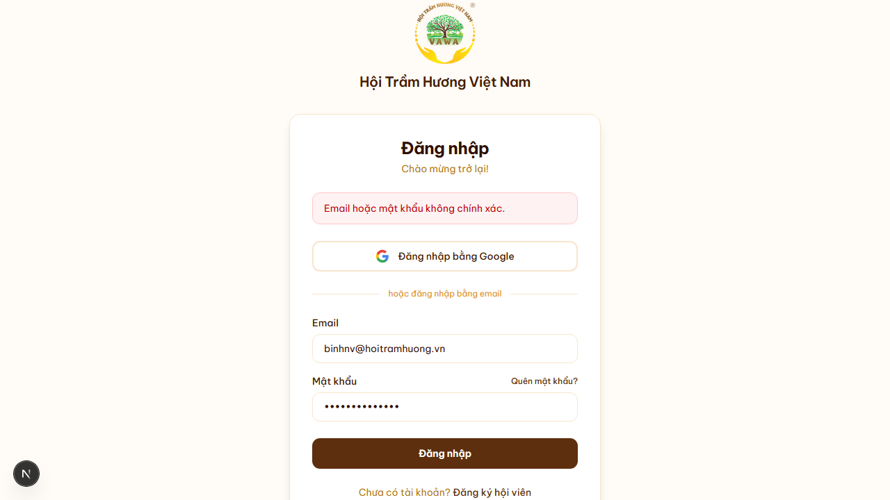
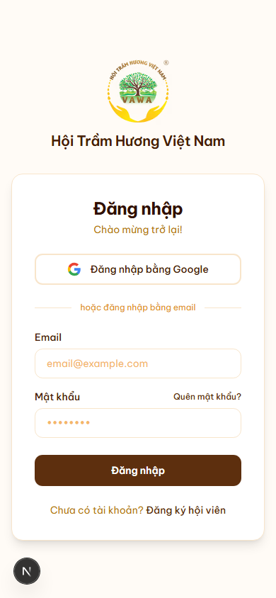

# 07. Đăng nhập

## Mục đích
Cho phép Hội viên và Admin đăng nhập để sử dụng các chức năng nội bộ (đăng bài, xem hồ sơ, gia hạn, quản trị…).

## Đối tượng
- Hội viên đã được cấp tài khoản (do Admin tạo, hoặc tự đăng ký)
- Admin

## Đường dẫn
- URL: `/login` (ví dụ: `/vi/login`, `/en/login`…)
- Public — ai cũng truy cập được; sau khi đăng nhập sẽ chuyển hướng về trang chủ.

## Cách đăng nhập
Có 2 cách song song:

### Cách 1 — Đăng nhập bằng Google
1. Nhấn nút **"Đăng nhập bằng Google"** ở phía trên.
2. Chọn tài khoản Google → cấp quyền (lần đầu).
3. Hệ thống tự tạo session và chuyển về trang chủ.
4. *Yêu cầu:* email Google phải khớp với email tài khoản đã tồn tại trong hệ thống. Nếu chưa có, hệ thống sẽ tạo tài khoản mới ở tầng "Khách (GUEST)".

### Cách 2 — Đăng nhập bằng email + mật khẩu
1. Nhập **Email** đã đăng ký (vd: `binhnv@hoitramhuong.vn`).
2. Nhập **Mật khẩu**.
3. Nhấn nút **"Đăng nhập"**.
4. Nếu sai email/mật khẩu, form hiển thị thông báo *"Email hoặc mật khẩu không chính xác."* — nhập lại hoặc dùng **Quên mật khẩu**.

## Liên kết phụ trên trang
- **"Quên mật khẩu?"** (góc phải nhãn "Mật khẩu") → dẫn tới `/quen-mat-khau` để tự khôi phục qua email (xem tài liệu mục 8).
- **"Chưa có tài khoản? Đăng ký hội viên"** (cuối form) → dẫn tới `/dang-ky` để đăng ký mới (xem tài liệu mục 6).

## Sau khi đăng nhập thành công
- Mọi vai trò (Hội viên / Admin) đều được điều hướng về **trang chủ** (`/`) ở chế độ xem (viewer mode), không tự nhảy thẳng vào dashboard.
- Từ trang chủ:
  - Hội viên vào **Tổng quan** qua menu người dùng (góc phải) → mục **"Tổng quan"** (`/tong-quan`).
  - Admin vào **Quản trị** qua menu → **"Quản trị"** (`/admin`).
- Session được duy trì bằng cookie HTTP-only của NextAuth; mặc định không tick "Remember me" — đóng trình duyệt vẫn còn phiên trong khoảng thời gian cấu hình.

## Lưu ý
- Form yêu cầu **đủ cả email và mật khẩu** mới gọi API; nếu thiếu, có cảnh báo "Vui lòng nhập đủ thông tin."
- Trang đăng nhập đa ngôn ngữ — tự động dịch theo lựa chọn locale (VI/EN/中文/العربية).
- Tài khoản bị Admin **khóa** sẽ KHÔNG đăng nhập được, hệ thống trả về cùng thông báo "Email hoặc mật khẩu không chính xác." (vì lý do bảo mật, không tiết lộ trạng thái tài khoản).

## Hình ảnh minh họa

**Form đăng nhập trống (desktop)**

**Form đã điền email + mật khẩu**

**Báo lỗi khi sai mật khẩu**

**Form trên mobile (390×844)**

