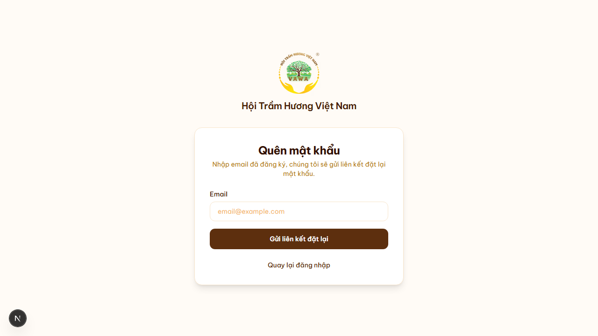
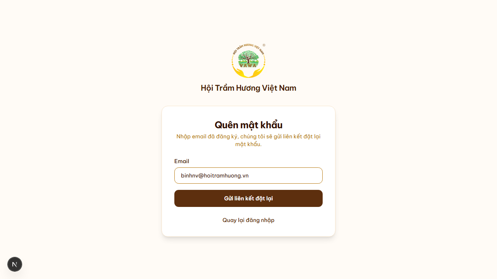
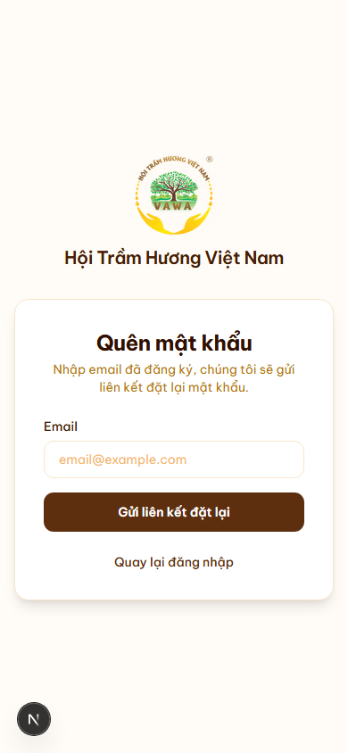

# 08. Quên mật khẩu (self-service)

## Mục đích
Cho phép Hội viên tự khôi phục mật khẩu qua email mà không cần nhờ admin can thiệp.

## Đối tượng
- Hội viên / Tài khoản cơ bản (GUEST) đã đăng ký.
- **KHÔNG áp dụng cho Admin** — admin phải reset qua DB / kênh khác (rule bảo mật).

## Đường dẫn
- URL: `/quen-mat-khau`
- Liên kết từ trang đăng nhập (link nhỏ "Quên mật khẩu?" cạnh nhãn ô Mật khẩu).

## Quy trình
1. User truy cập `/quen-mat-khau` → nhập email đã đăng ký.
2. Nhấn **"Gửi email khôi phục"**.
3. Server gọi `POST /api/auth/forgot-password`:
   - Validate email format.
   - Tra `User` theo email.
   - Nếu **email không tồn tại HOẶC user là Admin** → vẫn trả về `success: true` (giữ generic response để **chống enumeration** — kẻ tấn công không phân biệt được email nào tồn tại).
   - Nếu hợp lệ → tạo `VerificationToken` (32-byte hex) hết hạn sau **48 giờ**, xóa các token cũ của email này.
   - Gửi email từ `noreply@hoitramhuong.vn` kèm nút **"Đặt mật khẩu mới"** → link tới `/dat-mat-khau?token=<...>&email=<...>`.
4. UI chuyển sang trang **"✅ Kiểm tra email của bạn"** với link quay về đăng nhập.

## Đặt mật khẩu mới (`/dat-mat-khau`)
1. User nhấn link trong email → mở `/dat-mat-khau?token=...&email=...`.
2. Server kiểm tra token:
   - Khớp `identifier = email` và còn hạn (chưa qua 48h).
3. User nhập mật khẩu mới (≥ 8 ký tự) + xác nhận lại.
4. Server hash bằng bcrypt → cập nhật `User.password` → **xóa `VerificationToken`** đã dùng.
5. Tự động redirect về `/login` để đăng nhập.

## Lưu ý bảo mật
- **Token chỉ dùng 1 lần**: sau khi đổi mật khẩu, token bị xóa khỏi DB.
- **Token hết hạn 48h** — đủ để user ngó email không gấp, đồng thời ngắn để giảm rủi ro.
- **Anti-enumeration**: API luôn trả `success: true` kể cả khi email không tồn tại → kẻ tấn công không thu thập được danh sách email hợp lệ.
- **Admin không dùng được flow này** — phải reset qua database hoặc kênh nội bộ. Rule này có lý do: tránh trường hợp admin bị xâm hại email cá nhân kéo theo mất quyền hệ thống.

## Trường hợp lỗi
- Token sai/hết hạn → trang `/dat-mat-khau` báo lỗi và đề nghị nộp lại đơn quên mật khẩu.
- Mật khẩu mới quá ngắn → form từ chối với hướng dẫn ≥ 8 ký tự.

## Hình ảnh minh họa

**Form quên mật khẩu — trống (desktop)**

**Form quên mật khẩu — đã điền email**

**Form quên mật khẩu — mobile**

