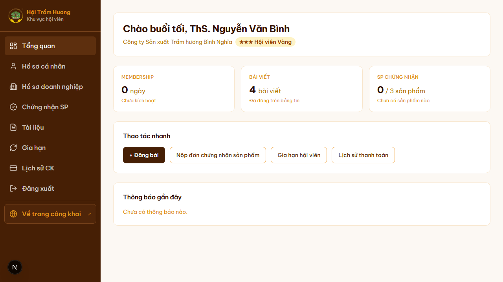
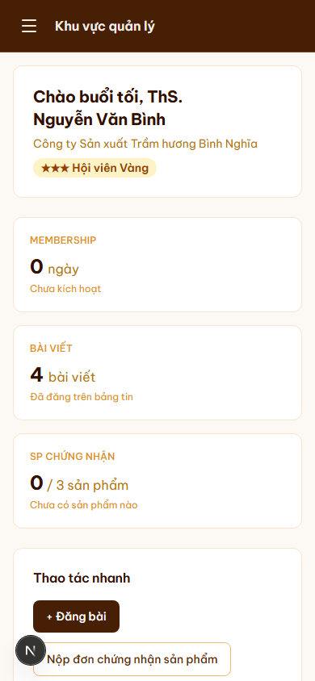

# 10. Dashboard hội viên (Tổng quan)

## Mục đích
Trang đầu tiên hội viên thấy sau khi nhấn menu **"Tổng quan"** từ trang chủ. Tổng hợp nhanh số ngày membership còn lại, số bài đã đăng, số sản phẩm đã chứng nhận, các thao tác nhanh và thông báo gần đây.

## Đối tượng
- Hội viên (★ / ★★ / ★★★)
- Admin (cũng truy cập được nhưng dashboard chính của admin nằm ở `/admin`)

## Đường dẫn
- URL: `/tong-quan`
- Cách vào: sau khi đăng nhập → menu user (góc phải header) → **"Tổng quan"**, hoặc gõ thẳng URL.
- Khách chưa đăng nhập sẽ bị redirect về `/login`.

## Bố cục
1. **Sidebar bên trái** (sticky): Tổng quan / Hồ sơ cá nhân / Hồ sơ doanh nghiệp / Chứng nhận SP / Tài liệu / Gia hạn / Lịch sử CK / Đăng xuất + nút "Về trang công khai".
2. **Card chào** — "Chào buổi sáng/chiều/tối, <Họ tên>" + tên doanh nghiệp + huy hiệu hạng (★★★ Hội viên Vàng, ★★ Hội viên Bạc, ★ Hội viên Đồng).
3. **3 thẻ thống kê** (link nhanh):
   - **Membership** — số ngày còn lại + ngày hết hạn → click vào `/gia-han`.
   - **Bài viết** — tổng số bài đã `PUBLISHED` của user → click vào `/feed`.
   - **SP Chứng nhận** (chỉ Doanh nghiệp) — số sản phẩm `APPROVED / tổng số` → click vào `/chung-nhan/nop-don`.
   - Hội viên cá nhân thấy thẻ thay thế: **Tài liệu Hội** → `/tai-lieu`.
4. **Thao tác nhanh** — 4 nút: Đăng bài / Nộp đơn chứng nhận sản phẩm / Gia hạn hội viên / Lịch sử thanh toán.
5. **Thông báo gần đây** — timeline 6 mục từ:
   - Thanh toán: SUCCESS / PENDING / FAILED
   - Chứng nhận: APPROVED / REJECTED / UNDER_REVIEW

## Hiển thị hạng (tier)
- Tính dựa trên `contributionTotal` (tổng đóng góp đã xác nhận) + `accountType`.
- 3 hạng: Đồng (★) / Bạc (★★) / Vàng (★★★) — ngưỡng cấu hình ở `lib/tier.ts`, có thể override qua SiteConfig.
- Huy hiệu thị trường: bg amber-100, text amber-800.

## Lưu ý
- Trang cache 60 giây (`revalidate = 60`) — sau khi gia hạn, có thể chậm đến 1 phút mới refresh số liệu.
- Membership "Chưa kích hoạt" / "0 ngày" có nghĩa: chưa đóng phí lần đầu hoặc đã hết hạn.
- Thông báo PENDING (chờ xác nhận) sẽ chuyển thành SUCCESS khi admin xác nhận thanh toán tại `/admin/thanh-toan`.

## Hình ảnh minh họa

**Dashboard hội viên (desktop)**

**Dashboard hội viên — mobile**

