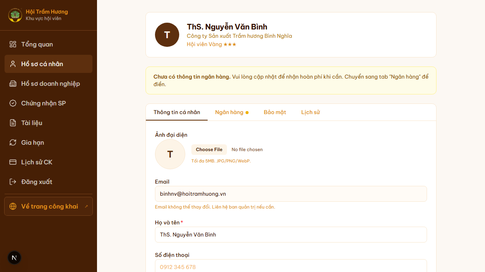
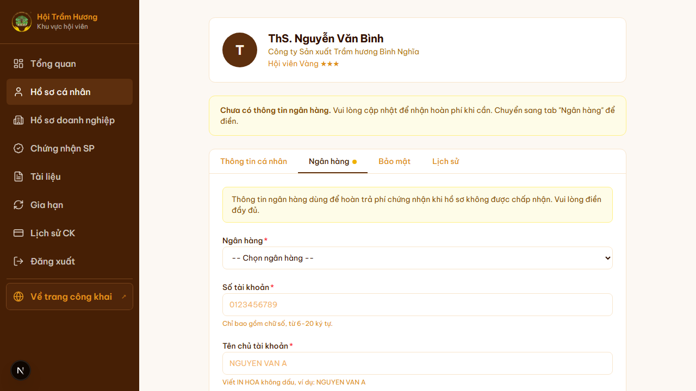
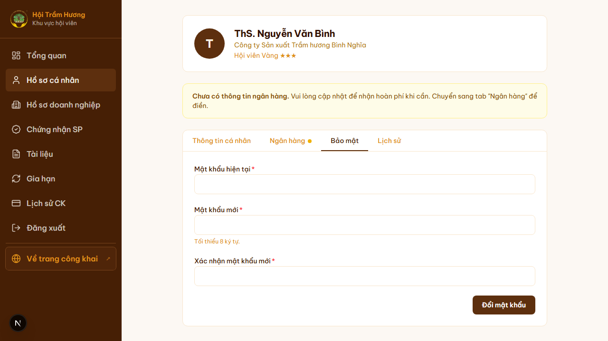
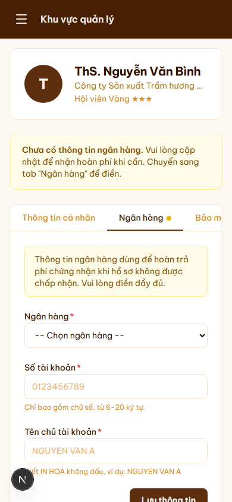
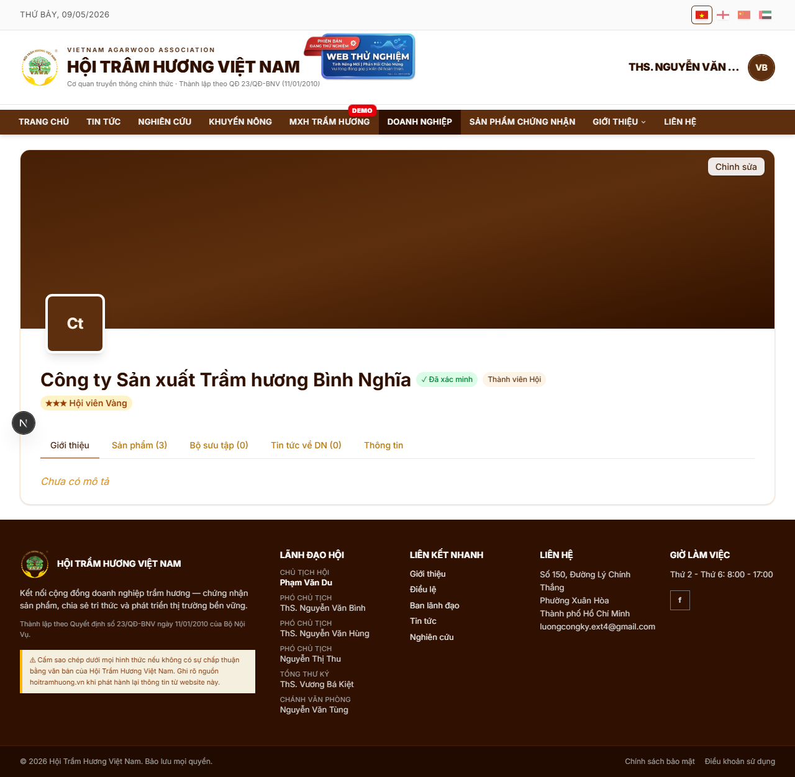
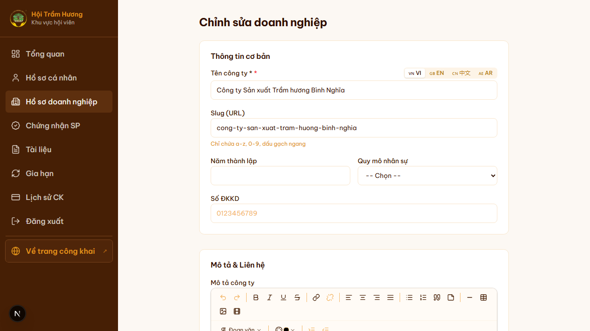

# 11. Hồ sơ doanh nghiệp + upload logo

## Mục đích
Hội viên cập nhật thông tin doanh nghiệp/cá nhân của mình. Tách thành 2 trang:
- **Hồ sơ cá nhân** (`/ho-so`) — thông tin user + ngân hàng + bảo mật + lịch sử.
- **Chỉnh sửa doanh nghiệp** (`/doanh-nghiep/chinh-sua`) — thông tin Company, upload logo + cover.

## Đối tượng
- Hội viên / Tài khoản cơ bản đã đăng nhập.
- Admin có thể chỉnh sửa của bất kỳ doanh nghiệp nào (qua `?slug=...`).

## Hồ sơ cá nhân (`/ho-so`)
4 tab:

### Tab 1 — Thông tin cá nhân
- Họ tên, email (read-only), số điện thoại
- Ảnh đại diện (avatar) — upload Cloudinary
- Tiểu sử (bio) đa ngôn ngữ: 4 ô nhập VI / EN / 中文 / العربية
- Chức danh (đối với Hội viên có doanh nghiệp): "Chủ tịch HĐQT", "Giám đốc"… (cũng đa ngôn ngữ)

### Tab 2 — Ngân hàng
Thông tin tài khoản dùng để **hoàn phí** khi đơn chứng nhận sản phẩm bị từ chối:
- Ngân hàng (dropdown danh sách ngân hàng VN)
- Số tài khoản (chỉ chữ số, 6–20 ký tự)
- Tên chủ tài khoản (yêu cầu IN HOA, không dấu, vd: `NGUYEN VAN A`)

### Tab 3 — Bảo mật
- Đổi mật khẩu (yêu cầu nhập mật khẩu cũ + mới + xác nhận)

### Tab 4 — Lịch sử
- Lịch sử các kỳ membership (validFrom – validTo, số tiền đóng, trạng thái thanh toán)

## Hồ sơ doanh nghiệp (`/doanh-nghiep-cua-toi`)
- Hiển thị **trang doanh nghiệp như khách thấy**, kèm nút **"Chỉnh sửa"** (nếu là chủ DN hoặc admin).
- Các tab thông tin: Giới thiệu / Sản phẩm / Bài viết / Tin tức về SP / Thông tin công ty.

## Chỉnh sửa doanh nghiệp (`/doanh-nghiep/chinh-sua`)

### Khối "Thông tin cơ bản"
- **Tên công ty** — đa ngôn ngữ 4 tab VI/EN/中文/AR
- **Slug (URL)** — chỉ chữ thường, số, dấu gạch ngang. Slug là phần cuối của URL `/doanh-nghiep/<slug>`.
- **Năm thành lập**
- **Quy mô nhân sự** (dropdown: 1-10 / 11-50 / 51-200 / >200)
- **Số ĐKKD**

### Khối "Mô tả & Liên hệ"
- **Mô tả công ty** — TipTap editor (rich text với image + video).
- Website, điện thoại, địa chỉ.

### Khối "Hình ảnh"
- **Logo công ty** — upload Cloudinary, folder `companies/{MM-YYYY}/`.
  - Khuyến nghị PNG vuông, ≥ 400×400px.
- **Ảnh bìa (cover)** — banner ngang 16:9.
- Sau khi upload, ảnh tự động chèn URL vào trường tương ứng.

### Lưu thay đổi
- Nút **"Lưu"** ở cuối trang. Server validate slug unique → cập nhật → revalidate cache `/doanh-nghiep` + `/doanh-nghiep/<slug>`.

## Quyền
- Hội viên chỉ sửa được DN của mình (`Company.ownerId == user.id`).
- Admin sửa được mọi DN qua `?slug=...`.

## Lưu ý
- Slug **đổi thì link cũ chết** — cẩn trọng. Hệ thống không tự redirect 301.
- Logo upload qua Cloudinary, lưu URL vào `Company.logoUrl`.
- Bản dịch các ô đa ngôn ngữ — nếu để trống, fallback về VI.

## Hình ảnh minh họa

**Hồ sơ cá nhân — Tab Thông tin**

**Hồ sơ cá nhân — Tab Ngân hàng** (mặc định khi chưa điền)

**Hồ sơ cá nhân — Tab Bảo mật**

**Hồ sơ cá nhân — mobile**

**Trang doanh nghiệp của tôi (xem như khách)**

**Form chỉnh sửa doanh nghiệp (4 tab dịch ở góc phải tên công ty)**

