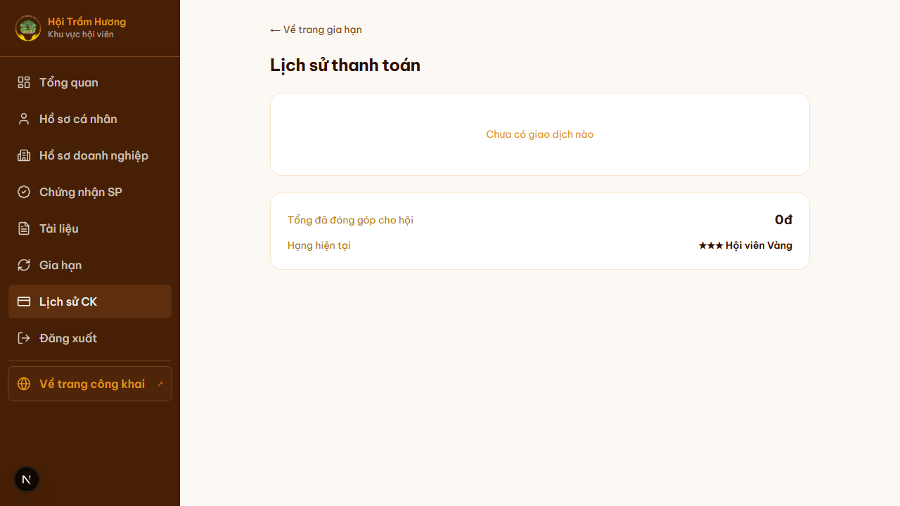
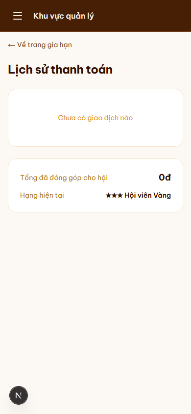

# 14. Lịch sử thanh toán

## Mục đích
Cho hội viên xem toàn bộ giao dịch (chuyển khoản phí hội viên / phí chứng nhận / dịch vụ truyền thông) đã thực hiện.

## Đối tượng
- Hội viên đã đăng nhập.

## Đường dẫn
- URL: `/thanh-toan/lich-su`
- Cách vào: từ Tổng quan → nút **"Lịch sử thanh toán"**, hoặc sidebar → **"Lịch sử CK"**.

## Bố cục
1. **Link "← Về trang gia hạn"** — quay lại `/gia-han`.
2. **Tiêu đề** — "Lịch sử thanh toán".
3. **Bảng giao dịch** (mặc định trống nếu chưa có CK nào):
   - Mã giao dịch (orderCode)
   - Loại: Phí hội viên / Phí chứng nhận / Truyền thông
   - Số tiền
   - Trạng thái: SUCCESS (xanh) / PENDING (vàng) / FAILED (đỏ)
   - Ngày tạo
   - Hành động: Xem chi tiết
4. **Card tổng kết** dưới bảng:
   - **Tổng đã đóng góp cho hội** (tổng các payment SUCCESS).
   - **Hạng hiện tại** (★/★★/★★★ tính từ `contributionTotal`).

## Trạng thái payment
- **PENDING**: user đã tạo yêu cầu chuyển khoản nhưng admin chưa xác nhận.
- **SUCCESS**: admin đã xác nhận đã nhận tiền tại `/admin/thanh-toan` → cộng vào `contributionTotal` + gia hạn membership (nếu là MEMBERSHIP_FEE).
- **FAILED**: admin đánh dấu thất bại (vd: tiền chưa về sau quá lâu, hoặc nội dung CK sai không match được).

## Lưu ý
- Trang chỉ hiển thị payment của user đang đăng nhập, KHÔNG thấy của người khác.
- Khi admin xác nhận một CK, **trang sẽ tự cập nhật** sau khi user reload (không có realtime push).
- **Idempotency**: nếu đã có 1 PENDING payment cùng loại, hệ thống KHÔNG cho tạo thêm — buộc user phải chờ admin xử lý xong PENDING hiện tại trước.

## Hình ảnh minh họa

**Lịch sử thanh toán (chưa có giao dịch)**

**Lịch sử thanh toán — mobile**

