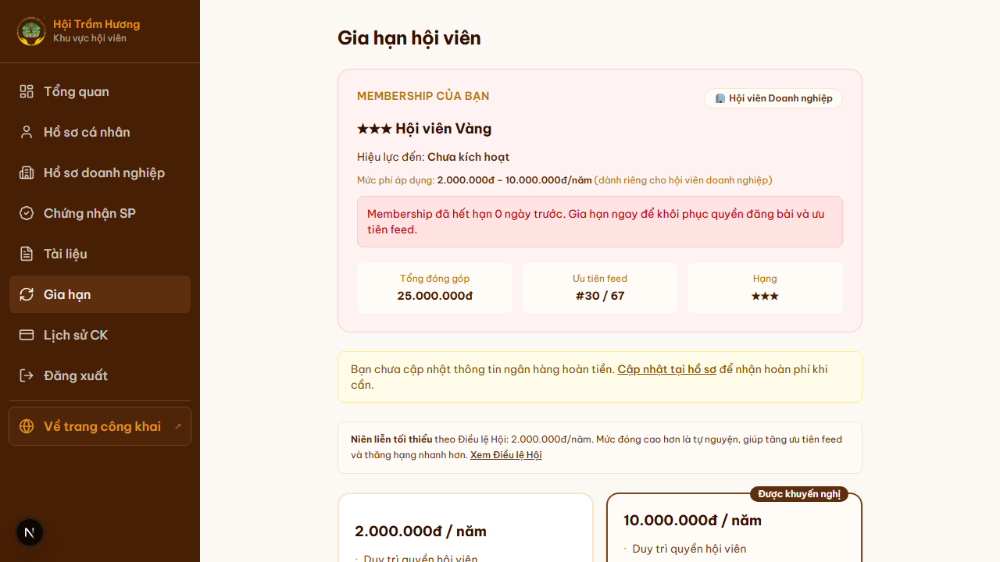
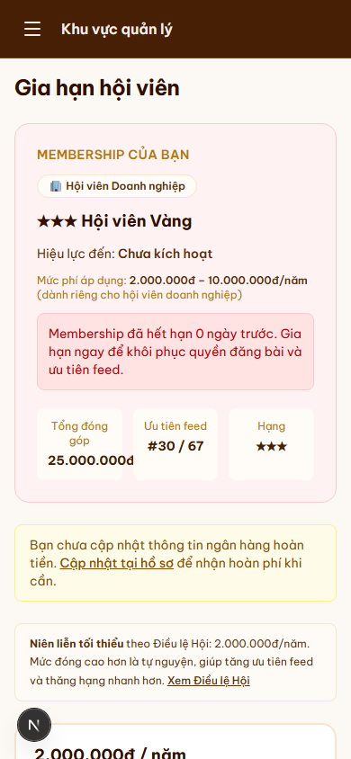

# 15. Gia hạn hội viên + format chuyển khoản

## Mục đích
Cho hội viên (Doanh nghiệp / Cá nhân) đóng phí năm để duy trì hoặc khôi phục tư cách hội viên. Hệ thống tạo **mã CK chuẩn** + thông tin ngân hàng để user chuyển khoản tay; sau đó admin xác nhận thủ công.

## Đối tượng
- Hội viên (Doanh nghiệp / Cá nhân) đã đăng nhập.

## Đường dẫn
- URL: `/gia-han`
- Cách vào: Tổng quan → thẻ **"Membership"** hoặc nút **"Gia hạn hội viên"**, hoặc sidebar → **"Gia hạn"**.

## Bố cục
1. **Tiêu đề** — "Gia hạn hội viên".
2. **Card "Membership của bạn"**:
   - Hạng hiện tại (★★★ Hội viên Vàng / ★★ Bạc / ★ Đồng).
   - Loại tài khoản: Hội viên Doanh nghiệp / Cá nhân.
   - **Hiệu lực đến**: ngày `membershipExpires` (hoặc "Chưa kích hoạt").
   - **Mức phí áp dụng**: ghi rõ khoảng `min – max` (vd Doanh nghiệp: `2.000.000 – 10.000.000đ/năm`).
   - **Cảnh báo** (nếu hết hạn): "Membership đã hết hạn N ngày trước. Gia hạn ngay…"
   - 3 thẻ thống kê: Tổng đóng góp / Ưu tiên feed (#X / Y) / Hạng (★★★).
3. **Cảnh báo cập nhật ngân hàng** — nếu user chưa điền tài khoản hoàn tiền tại tab "Ngân hàng" của hồ sơ.
4. **2 lựa chọn mức phí** (Doanh nghiệp):
   - **2.000.000đ / năm** — niên liễn tối thiểu theo Điều lệ.
   - **10.000.000đ / năm** — gắn nhãn **"Được khuyến nghị"** (đóng góp cao → tăng ưu tiên feed + thăng hạng nhanh).
5. **Nút "Tạo yêu cầu chuyển khoản"** — sau khi chọn mức phí.
6. **Modal hiển thị thông tin CK** (sau khi tạo):
   - Ngân hàng, số TK, tên chủ TK của Hội (lấy từ SiteConfig).
   - Số tiền (theo mức đã chọn).
   - **Nội dung CK** *(quan trọng — phải đúng để admin match)*: `HOITRAMHUONG-MEM-{INITIALS}-{YYYYMMDD}`
     - Ví dụ Nguyễn Văn Bình → `INITIALS = NVB` → `HOITRAMHUONG-MEM-NVB-20260509`
   - QR code chuyển khoản (nếu cấu hình bank có hỗ trợ VietQR).

## Quy trình từ A → Z
1. User chọn mức phí → nhấn **"Tạo yêu cầu CK"**.
2. Server validate `amount ∈ {feeMin, feeMax}` → tạo `Payment` với `status = PENDING`, `type = MEMBERSHIP_FEE`.
3. Hệ thống generate `description = HOITRAMHUONG-MEM-<INITIALS>-<YYYYMMDD>` (không trùng vì có ngày tạo).
4. **Idempotency**: nếu đã có PENDING `MEMBERSHIP_FEE` → từ chối tạo mới (`409`), yêu cầu chờ admin xử lý.
5. User chuyển khoản qua app ngân hàng theo đúng:
   - Số TK + ngân hàng đúng như card hiển thị.
   - **Nội dung phải y nguyên** chuỗi `HOITRAMHUONG-MEM-NVB-20260509` (KHÔNG thêm dấu, viết tắt, hoặc ghi chú khác).
6. Admin vào `/admin/thanh-toan?status=pending` → match từng giao dịch trong sao kê ngân hàng với `description` → click **"Xác nhận"**.
7. Hệ thống tự động:
   - Cập nhật `Payment.status = SUCCESS`.
   - Tạo `Membership` mới với `validFrom = now`, `validTo = now + 365d`.
   - Cộng `User.contributionTotal += amount`.
   - Tự thăng hạng nếu `contributionTotal` vượt ngưỡng.
   - Gửi email cảm ơn + xác nhận gia hạn.

## Niên liễn tối thiểu
Theo Điều lệ Hội: **2.000.000đ/năm** cho Hội viên Doanh nghiệp, **1.000.000đ/năm** cho Hội viên Cá nhân.

## Lưu ý
- **KHÔNG dùng PayOS / cổng thanh toán** — toàn bộ flow là chuyển khoản tay + admin xác nhận. Lý do: đặc thù cộng đồng, tránh phí cổng + giữ minh bạch.
- **Mã CK sai** → admin không match được, sẽ từ chối → tiền treo trong tài khoản Hội. Trường hợp này, user cần liên hệ trực tiếp Văn phòng Hội (qua /lien-he) để xử lý hoàn / điều chỉnh.
- Lệnh gia hạn **không có giới hạn lần** — user có thể đóng phí nhiều năm liên tiếp; mỗi lần SUCCESS sẽ extend `membershipExpires` thêm 365 ngày.

## Hình ảnh minh họa

**Trang Gia hạn — overview**

**Gia hạn — mobile**

