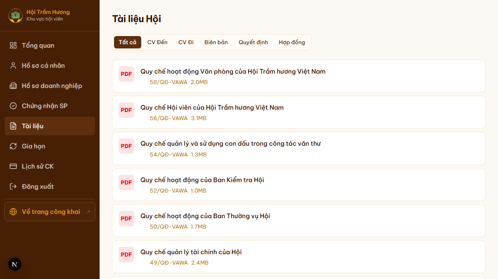
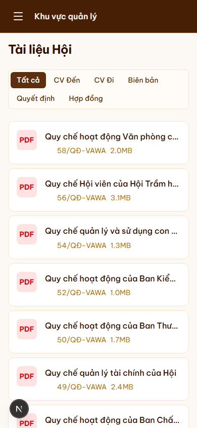

# 35. Tài liệu Hội (thư viện văn bản nội bộ)

## Mục đích
Khu vực tài liệu nội bộ dành cho Hội viên — công văn đến, công văn đi, biên bản họp, quyết định, hợp đồng. **Khác** với trang `/phap-ly` công khai (chỉ Điều lệ + Quy chế công bố), trang này lưu **tài liệu vận hành nội bộ**.

## Đối tượng
- Hội viên đã đăng nhập (kể cả tài khoản cơ bản — GUEST).
- Admin upload + quản lý.

## Đường dẫn
- Hội viên xem: `/tai-lieu`
- Admin quản lý: `/admin/tai-lieu`

## Bố cục trang Hội viên

### Tab phân loại
5 tab ở đầu trang:
- **Tất cả** (default)
- **CV Đến** (CONG_VAN_DEN) — công văn nhận từ cơ quan ngoài (Bộ Nội vụ, đối tác, doanh nghiệp...).
- **CV Đi** (CONG_VAN_DI) — công văn Hội phát hành.
- **Biên bản** (BIEN_BAN_HOP) — biên bản các cuộc họp Ban Thường vụ, Ban Chấp hành, Đại hội.
- **Quyết định** (QUYET_DINH) — quyết định nội bộ Chủ tịch, Ban Thường vụ.
- **Hợp đồng** (HOP_DONG) — hợp đồng đối tác, dịch vụ.

### Danh sách tài liệu
Mỗi item:
- Icon PDF
- Tên tài liệu (vd "Quy chế hoạt động Văn phòng của Hội Trầm Hương Việt Nam")
- Số hiệu (vd `58/QĐ-VAWA`)
- Dung lượng (vd `2.0MB`)
- Click → mở Google Drive viewer (preview).

### Chi tiết khi click
- URL: `/tai-lieu?doc=<id>` (giữ scroll position).
- Mở **Google Drive embedded viewer** trong iframe.
- Xem trực tuyến — KHÔNG download trực tiếp (lý do: tài liệu nội bộ, không muốn user lưu local rồi share ra ngoài).

## Quản trị (`/admin/tai-lieu`)

### Tính năng
1. **Upload tài liệu mới**:
   - Chọn category (5 loại trên).
   - Tên tài liệu, số hiệu, ngày ban hành, cơ quan.
   - File PDF — upload Google Drive (folder `tai-lieu/`).
   - Tick `isPublic` (true cho `/phap-ly`, false cho nội bộ `/tai-lieu`).
2. **Sửa metadata** + **xóa**.
3. **Tìm kiếm + filter** theo loại, năm.

### File storage
- Lưu Google Drive (PDF có thể nặng) — share link "anyone-with-link viewer".
- File ID lưu vào `Document.driveFileId` → preview URL build động qua `getPreviewUrl()`.

## Quyền truy cập
- Yêu cầu **đăng nhập** (proxy redirect `/login` nếu chưa).
- KHÔNG yêu cầu là Hội viên chính thức — Tài khoản cơ bản (GUEST) vẫn xem được — vì nhiều người chưa nộp phí vẫn cần xem biên bản, công văn.
- **Không hiển thị tài liệu `isPublic = false`** ở trang `/phap-ly` (chỉ public ở `/tai-lieu` cho member).

## Cache
- Trang `/tai-lieu` cache 1 giờ (`revalidate = 3600`).
- Khi admin upload mới → tag `documents` revalidate.

## Lưu ý
- Tài liệu **bí mật cao** (vd hợp đồng có giá trị lớn) — admin có thể đặt `accessLevel = "ADMIN_ONLY"` để hide khỏi list của hội viên thường.
- Tên file Drive **không nên đổi** sau upload — proxy URL phụ thuộc fileId.

## Hình ảnh minh họa

**Tài liệu Hội (tab Tất cả)**

**Tài liệu — mobile**

