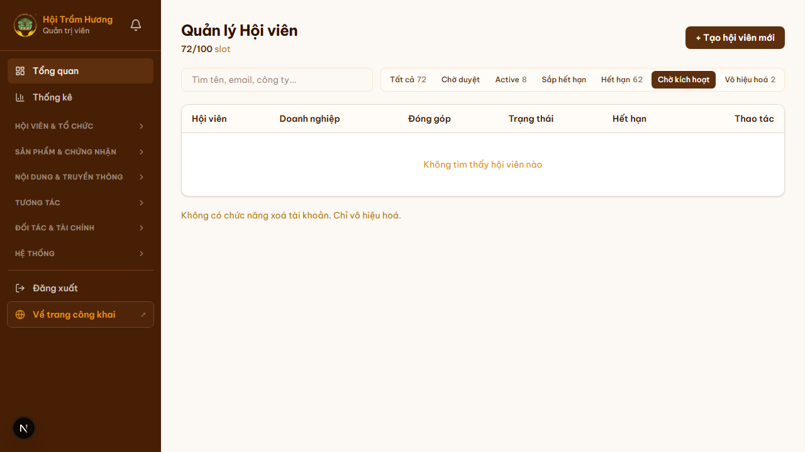
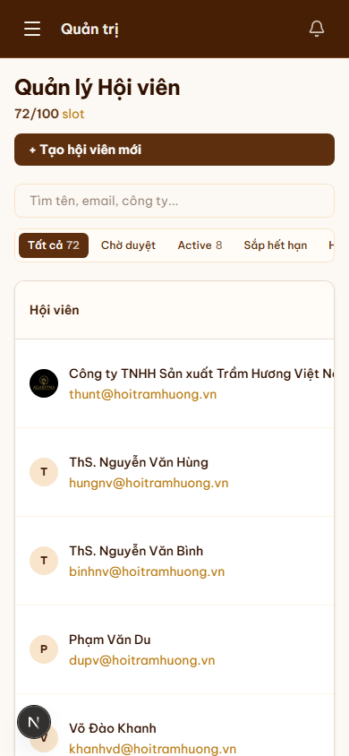

# 16. Admin — Quản lý hội viên

## Mục đích
Trang trung tâm để admin quản lý toàn bộ hội viên: xem danh sách, lọc theo trạng thái, duyệt đơn đăng ký, cập nhật hạng, kích hoạt / khóa tài khoản.

## Đối tượng
- Chỉ Admin (`role = "ADMIN"`).

## Đường dẫn
- URL: `/admin/hoi-vien`
- Lọc nhanh các đơn chờ duyệt: `/admin/hoi-vien?status=pending`

## Bố cục
1. **Header** — "Quản lý Hội viên" + chỉ số `<active>/<slot>` (vd 72/100 — slot tối đa cấu hình ở `max_vip_accounts`).
2. **Nút "+ Tạo hội viên mới"** (góc phải) → `/admin/hoi-vien/tao-moi`.
3. **Thanh tìm kiếm** — tìm theo tên, email, công ty.
4. **Bộ lọc theo trạng thái** (tab):
   - **Tất cả** (số tổng)
   - **Chờ duyệt** — đơn đăng ký mới (`isActive = false`, role GUEST/VIP, chưa từng login)
   - **Active** — đang còn hạn
   - **Sắp hết hạn** — còn ≤ 30 ngày
   - **Hết hạn** — `membershipExpires < now`
   - **Chờ kích hoạt** — đã approve nhưng user chưa đặt mật khẩu
   - **Vô hiệu hóa** — đã bị khóa
5. **Bảng danh sách** với các cột:
   - Hội viên (avatar + tên + email)
   - Doanh nghiệp
   - Đóng góp (tổng + huy hiệu hạng Vàng/Bạc/—)
   - Trạng thái (badge màu theo state)
   - Hết hạn (ngày)
   - Hành động: **Chi tiết** → `/admin/hoi-vien/[id]`
6. **Phân trang** — 20 row/page.

## Trang chi tiết hội viên (`/admin/hoi-vien/[id]`)
Cho phép admin:
- Xem đầy đủ hồ sơ user + DN.
- **Duyệt đơn đăng ký** (chuyển từ "Chờ duyệt" → gửi email link đặt mật khẩu).
- **Kích hoạt / Khóa** (toggle `isActive`).
- **Cập nhật hạng** thủ công (nếu cần override `displayPriority`).
- **Set thời hạn membership** thủ công (cấp năm miễn phí cho cá nhân nổi bật, etc.).
- **Reset mật khẩu** (gửi email tự đặt lại).

## Read-only mode
- Một số admin (vd: thư ký nội dung) có quyền đọc nhưng không thao tác — nút Action sẽ bị disable + tooltip giải thích lý do.
- Cấu hình bằng cờ ở `AdminReadOnlyContext`.

## Hình ảnh minh họa

**Danh sách hội viên (desktop)**

**Lọc đơn chờ duyệt (`?status=pending`)**

**Mobile**

