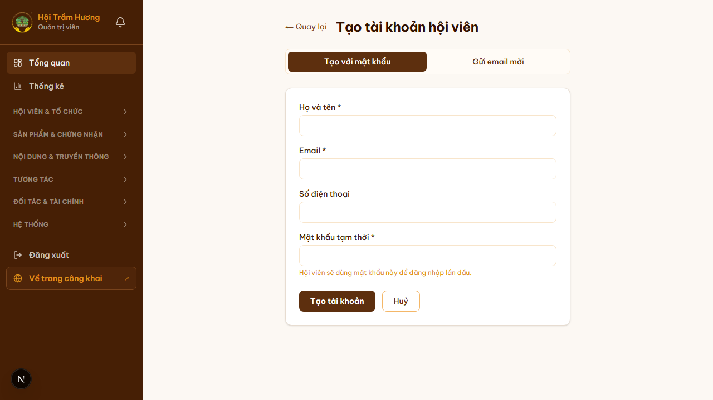

# 17. Admin — Tạo tài khoản hội viên

## Mục đích
Cho admin tạo tài khoản hội viên thủ công trong 2 trường hợp:
- Hội viên thân quen, không cần qua quy trình tự đăng ký + duyệt.
- Tạo nhanh tài khoản cho hội viên mới (đã đóng phí offline / sự kiện).

## Đối tượng
- Chỉ Admin.

## Đường dẫn
- URL: `/admin/hoi-vien/tao-moi`
- Cách vào: `/admin/hoi-vien` → nút **"+ Tạo hội viên mới"** (góc phải).

## ⚠️ Đã bỏ nhãn "VIP"
Trang **không còn** trường chọn hạng VIP/INFINITE như checklist gốc. Trong code thực tế:
- Tài khoản tạo mới có `role = "GUEST"`, `accountType = "BUSINESS"` mặc định.
- Hạng (★/★★/★★★) **được tính tự động** từ `contributionTotal` (tổng đóng góp đã xác nhận), KHÔNG do admin set khi tạo.
- Nếu cần "tặng hạng" (ví dụ tài trợ viên đặc biệt), admin phải **chuyển khoản giả lập** ở `/admin/thanh-toan` rồi cộng vào `contributionTotal`.

## 2 chế độ tạo

### Chế độ 1 — "Tạo với mật khẩu"
- Admin nhập sẵn mật khẩu tạm thời cho hội viên.
- Hội viên nhận thông báo qua kênh khác (Zalo, gọi điện) → tự dùng mật khẩu đó đăng nhập lần đầu rồi đổi.
- **Nguy cơ**: mật khẩu nằm trong tay admin tạm thời. Khuyến nghị bắt user đổi ngay sau lần đầu.

### Chế độ 2 — "Gửi email mời"
- Admin chỉ điền họ tên + email + (sđt).
- Server sinh token, gửi email cho user kèm link **"Đặt mật khẩu"** (token 48h).
- User click link → tự đặt mật khẩu → kích hoạt tài khoản.
- **Khuyến nghị dùng chế độ này** — bảo mật cao hơn, user tự kiểm soát mật khẩu từ đầu.

## Các trường form
| Trường | Bắt buộc | Ghi chú |
|---|---|---|
| Họ và tên | ✅ | Hiển thị ở dashboard, email |
| Email | ✅ | Phải duy nhất trong hệ thống |
| Số điện thoại | tùy chọn | |
| Mật khẩu tạm thời | ✅ (chỉ chế độ 1) | Hội viên dùng để đăng nhập lần đầu |

## Sau khi tạo
- **Chế độ 1**: redirect về `/admin/hoi-vien` (làm mới danh sách).
- **Chế độ 2**: hiển thị thông báo `"Đã tạo tài khoản và gửi email mời đến {email}"` + form reset.
- Tài khoản mới mặc định:
  - `role = GUEST` (tức Tài khoản cơ bản, KHÔNG phải Hội viên ngay).
  - `isActive = true` (đăng nhập được).
  - `membershipExpires = null` — admin cần vào `/admin/hoi-vien/[id]` set membership hoặc đợi user gia hạn.

## Lưu ý
- Để **biến thành Hội viên chính thức**, phải tiếp nối bằng:
  - Vào chi tiết user → set `membershipExpires` (1 năm).
  - Hoặc tạo bản ghi `Membership` thủ công + payment SUCCESS để có lịch sử rõ ràng.
- Slot tối đa: cấu hình `max_vip_accounts` trong SiteConfig (mặc định 100). Đạt giới hạn → không tạo thêm được.

## Hình ảnh minh họa

**Form tạo tài khoản — chế độ "Tạo với mật khẩu"**

