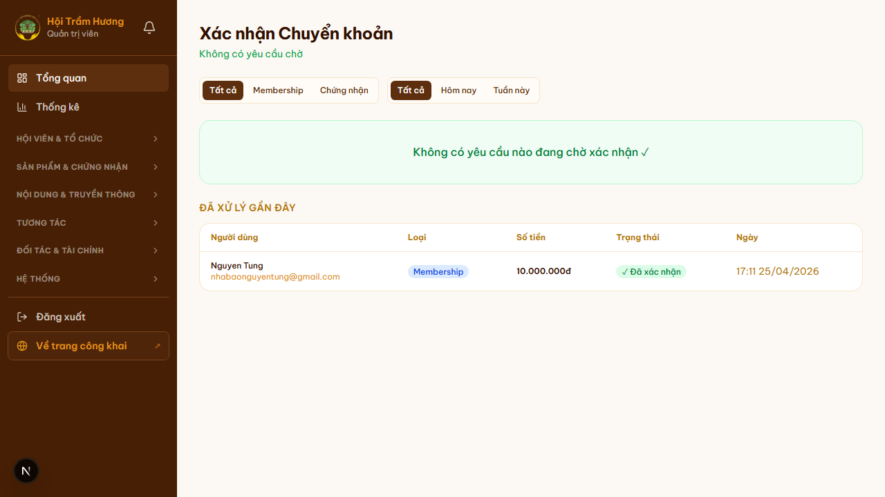
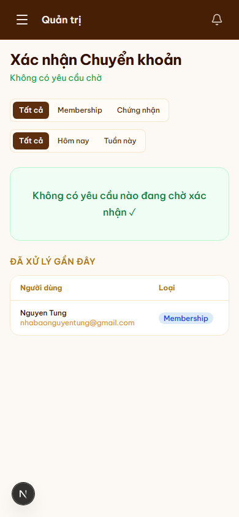

# 18. Admin — Xác nhận thanh toán thủ công

## Mục đích
Khi hội viên chuyển khoản phí (gia hạn / chứng nhận / truyền thông), admin đối chiếu sao kê ngân hàng → xác nhận đã nhận tiền → hệ thống tự động kích hoạt quyền lợi.

## Đối tượng
- Admin (đặc biệt thủ quỹ).

## Đường dẫn
- URL: `/admin/thanh-toan`
- Lọc theo loại: tab **Tất cả / Membership / Chứng nhận**.
- Lọc theo thời gian: tab **Tất cả / Hôm nay / Tuần này**.

## Bố cục
1. **Header** "Xác nhận Chuyển khoản" + thông báo số yêu cầu chờ.
2. **Filter tabs** — combo loại × thời gian.
3. **Khu vực "Chờ xác nhận"** (nổi bật):
   - Mỗi PENDING payment hiển thị card với:
     - Tên user + email + DN
     - Loại (Membership / Chứng nhận / Truyền thông)
     - Số tiền
     - **Nội dung CK gốc** (vd: `HOITRAMHUONG-MEM-NVB-20260509`)
     - Thời gian tạo yêu cầu
   - 2 nút: **"✓ Xác nhận đã nhận tiền"** / **"✗ Từ chối"**.
4. **Khu vực "Đã xử lý gần đây"** — bảng các payment đã xác nhận / từ chối, có thể undo trong 24h.

## Quy trình xác nhận
1. Admin mở **Internet Banking** của Hội → tìm sao kê.
2. Match từng dòng sao kê với `description` của một PENDING payment trong trang admin.
3. Nếu match đúng → click **"✓ Xác nhận"**.
   - Hệ thống cập nhật `Payment.status = SUCCESS`.
   - Tự động trigger các hành động dây chuyền:
     - **MEMBERSHIP_FEE**: tạo `Membership` mới, gia hạn `User.membershipExpires += 365d`, cộng `contributionTotal`, gửi email cảm ơn + ghi vào sổ quỹ thu chi.
     - **CERTIFICATION_FEE**: chuyển trạng thái đơn chứng nhận từ `PENDING` → `UNDER_REVIEW`, kích hoạt hội đồng.
     - **MEDIA_FEE**: kích hoạt slot truyền thông đã thuê.
4. Nếu **không tìm thấy** giao dịch trong sao kê (user lừa đảo, sai nội dung CK quá nhiều) → click **"✗ Từ chối"** với lý do.
   - User nhận thông báo PENDING bị từ chối → buộc tạo yêu cầu mới hoặc liên hệ admin.

## Tự động ghi sổ quỹ
Khi xác nhận thành công, hệ thống **tự động tạo** giao dịch trong **Sổ quỹ thu chi** (`/admin/thu-chi`):
- Loại: Thu
- Nguồn: Phí membership / Phí chứng nhận / Dịch vụ truyền thông
- Số tiền: `Payment.amount`
- Tham chiếu: `Payment.id` + `description`

(Tính năng đã được thêm 2026-05 — xem ADR ledger.)

## Lưu ý
- **Idempotency**: 1 user chỉ có thể có **1 PENDING payment cùng loại** tại 1 thời điểm. Đảm bảo admin không vô tình duyệt trùng.
- **Read-only mode**: nếu admin chỉ có quyền xem (không thủ quỹ), nút Xác nhận / Từ chối bị disable kèm tooltip.
- **Không có cổng thanh toán**: 100% chuyển khoản thủ công. Đặc thù cộng đồng + minh bạch + tránh phí cổng.

## Hình ảnh minh họa

**Trang xác nhận thanh toán (không có yêu cầu chờ)**

**Mobile**

