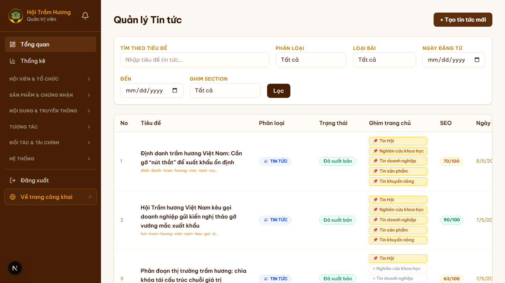
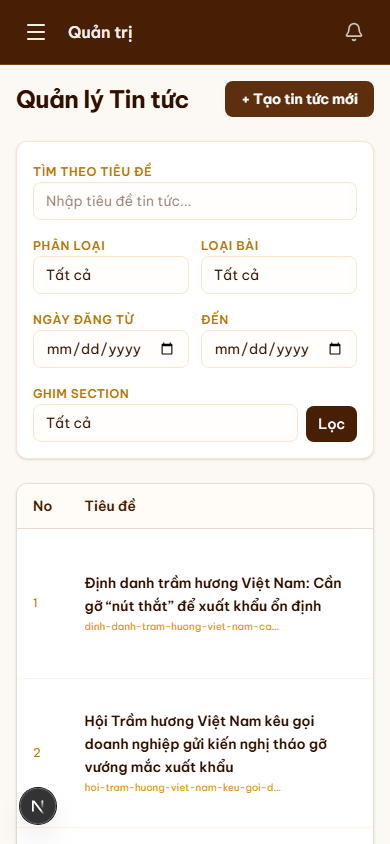

# 19. Admin — Đăng / quản lý tin tức

## Mục đích
Quản lý nội dung tin tức xuất hiện ở trang công khai (`/tin-tuc`, trang chủ, sidebar bài chi tiết, RSS feed). Cho phép tạo mới, sửa, ghim, gỡ ghim, ẩn/hiện, sắp xếp SEO, gắn thẻ phân loại đa kênh.

## Đối tượng
- Admin.

## Đường dẫn
- Danh sách: `/admin/tin-tuc`
- Tạo mới: `/admin/tin-tuc/[id]` *(form unified — id rỗng = tạo mới)* hoặc nút **"+ Tạo tin tức mới"**.
- Đăng bài thường (Post — feed): `/admin/bai-viet`.

## Trang danh sách (`/admin/tin-tuc`)

### Bộ lọc
- **Tìm theo tiêu đề** (full text)
- **Phân loại** — News.category: TIN_TUC, NGHIEN_CUU, KHUYEN_NONG, TIN_BAO_CHI...
- **Loại bài** — template kiểu trình bày
- **Ngày đăng từ — đến**
- **Ghim section** — đang ghim ở section nào (Tin Hội, Nghiên cứu khoa học, Tin doanh nghiệp, Tin sản phẩm, Tin khuyến nông…)

### Bảng
- STT
- Tiêu đề (kèm slug)
- Phân loại (chip)
- Trạng thái: Đã xuất bản / Bản nháp / Ẩn
- **Ghim trang chủ** — chip multi-select. Mỗi bài có thể ghim cùng lúc lên nhiều section.
- SEO score (vd 70/100, 90/100) — tính từ độ dài tiêu đề, meta desc, alt image, structured data...
- Ngày đăng

## Soạn / sửa bài (`/admin/tin-tuc/[id]`)

### Các trường
- **Tiêu đề** (đa ngôn ngữ 4 tab VI/EN/中文/AR)
- **Slug** (auto-generate từ tiêu đề; admin có thể sửa)
- **Sapo** (excerpt, đa ngôn ngữ)
- **Cover image** (Cloudinary, folder `news/{MM-YYYY}/`)
- **Gallery** (nhiều ảnh — TipTap inline)
- **Body** (TipTap rich text với image, video YouTube embed, table, quote, code…)
- **Category chính** (News.category — required)
- **Categories phụ** (`secondaryCategories` — multi-select; bài có thể vừa thuộc TIN_TUC vừa NGHIEN_CUU)
- **Template** (`PUBLIC` / `PRESS` — quy định cách bố trí trang chi tiết)
- **Ghim**:
  - `isPinned` — pin lên đầu danh sách
  - `pinSections` — multi-select các section trang chủ (Tin Hội, Tin DN, Tin SP, Khuyến nông, Báo chí…)
- **isPublished** — bật mới hiện công khai
- **publishedAt** — ngày đăng (cho phép set tương lai → schedule, hoặc null = nháp)

### Hỗ trợ AI dịch
- Nút **"Dịch từ VI"** trên 3 tab (EN / 中文 / AR) → gọi GPT/Claude API → tự điền bản dịch tiêu đề + sapo + body.
- Sau dịch, admin có thể tinh chỉnh thủ công.
- Bản dịch trống → fallback về VI khi locale switch.

### SEO
- Live SEO score panel ở sidebar — tính realtime khi sửa.
- Gợi ý: meta title 50-60 ký tự, meta desc 140-160 ký tự, alt image phải có, body ≥ 300 từ…

## Tự động bỏ ghim sau 2 ngày
- **Auto-unpin cron** (commit `ccc3349`): các bài có `isPinned = true` quá **2 ngày** sẽ tự `isPinned = false`.
- Mục đích: tránh trang chủ "đứng yên" với 1 bài cũ.
- Bài quan trọng cần ghim lâu → bật lại bằng tay sau 2 ngày, hoặc chỉnh `pinnedAt` trong DB.

## Lưu ý
- Sau khi đăng, cache `/tin-tuc` revalidate qua tag `news`/`tin-tuc` → bài mới hiện trong vòng vài giây.
- Bài có `publishedAt = null` không xuất hiện ở hero list, chỉ ở Latest.
- Bài có `template = PRESS` (tin báo chí) hiện đang **ẩn khỏi menu CategoryBar** theo yêu cầu khách (giữ route + admin editor để sau bật lại không refactor).

## Hình ảnh minh họa

**Danh sách tin tức**

**Mobile**

