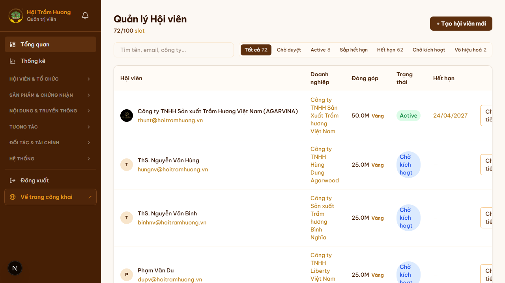

# 20. Admin — Kích hoạt / khóa tài khoản

## Mục đích
Cho admin can thiệp vào trạng thái hoạt động của một tài khoản hội viên: khóa do vi phạm, mở khóa lại, kích hoạt sau khi đóng phí offline, etc.

## Đối tượng
- Admin (đặc biệt vai trò quản lý người dùng).

## Đường dẫn
- Danh sách: `/admin/hoi-vien`
- Chi tiết: `/admin/hoi-vien/[id]`

## Các trạng thái tài khoản

| Trạng thái | Cờ trong DB | Ý nghĩa |
|---|---|---|
| **Chờ duyệt** | `isActive = false` + chưa từng login | Đơn đăng ký mới, admin chưa duyệt |
| **Chờ kích hoạt** | `isActive = false` + đã được approve, chưa đặt mật khẩu | Đã gửi email link đặt mật khẩu, đang chờ user click |
| **Active** | `isActive = true` + `membershipExpires > now` | Đang hoạt động bình thường |
| **Sắp hết hạn** | `isActive = true` + còn ≤ 30 ngày | Cần nhắc gia hạn |
| **Đã hết hạn** | `isActive = true` + `membershipExpires < now` | Vẫn login được nhưng mất quyền lợi Hội viên (vd KHÔNG đăng bài, KHÔNG nộp đơn chứng nhận) |
| **Vô hiệu hóa** | `isActive = false` + đã từng login | Đã bị admin khóa hoặc user tự xóa |

## Các thao tác từ trang chi tiết

### 1. Duyệt đơn đăng ký
- Áp dụng cho user **Chờ duyệt**.
- Nút **"Duyệt"** → chuyển `isActive = false → false` (giữ nguyên) nhưng:
  - Tạo `VerificationToken` (token đặt mật khẩu, 48h).
  - Gửi email cho user kèm link `/dat-mat-khau?token=...`.
  - User click link → đặt mật khẩu → `isActive = true` automatically.
- Nút **"Từ chối"** → xóa user khỏi DB hoặc đánh dấu rejected; gửi email từ chối (tùy cấu hình).

### 2. Khóa tài khoản
- Áp dụng cho user **Active / Hết hạn**.
- Toggle **"Vô hiệu hóa"** → `isActive = false`.
- User bị khóa **không đăng nhập được** (login API trả thông báo chung "Email/mật khẩu không chính xác" để không lộ trạng thái).
- Bài viết, comment, sản phẩm đã đăng **vẫn còn** (không tự ẩn) — admin có thể ẩn riêng nếu cần.

### 3. Mở khóa
- Toggle ngược lại — `isActive = true` → user đăng nhập được lại.

### 4. Reset mật khẩu
- Nút **"Reset mật khẩu"** → gửi email link đặt lại (giống flow self-service `/quen-mat-khau`).
- Token 48h, dùng 1 lần.

### 5. Set membership expiry thủ công
- Cho phép admin gia hạn membership tay (vd hội viên đóng tiền mặt tại sự kiện):
  - Set `membershipExpires` = ngày tùy chọn.
  - **KHÔNG tự cộng `contributionTotal`** — phải tạo Payment SUCCESS riêng nếu muốn ghi sổ quỹ.

### 6. Cập nhật hạng / displayPriority thủ công
- `displayPriority` (mặc định 0) — admin có thể set 1, 2, 3... để **nổi bật** hội viên trên trang chủ "Hội viên tiêu biểu".

## Quyền và giới hạn
- **Admin chính** (super-admin) có toàn quyền.
- **Admin phụ** (vd biên tập viên) có thể bị giới hạn — không thấy nút Khóa / Reset / Xóa.
- **KHÔNG ai** có thể khóa tài khoản admin khác qua UI (rule bảo vệ — chỉ qua DB).

## Audit log
- Mỗi thao tác (duyệt, khóa, reset) được ghi vào `AuditLog` để truy vết về sau.
- Admin có thể xem audit log tại `/admin/giam-sat`.

## Lưu ý
- **Sự khác biệt** giữa "Hết hạn membership" và "Vô hiệu hóa":
  - Hết hạn: vẫn login, vẫn xem trang admin (nếu là admin), nhưng KHÔNG có quyền lợi Hội viên.
  - Vô hiệu hóa: KHÔNG login được nữa.
- Admin bị quên mật khẩu: KHÔNG dùng được self-service `/quen-mat-khau` (rule bảo mật) — phải reset qua DB.

## Hình ảnh minh họa

**Trạng thái tài khoản hiển thị bằng badge màu**

