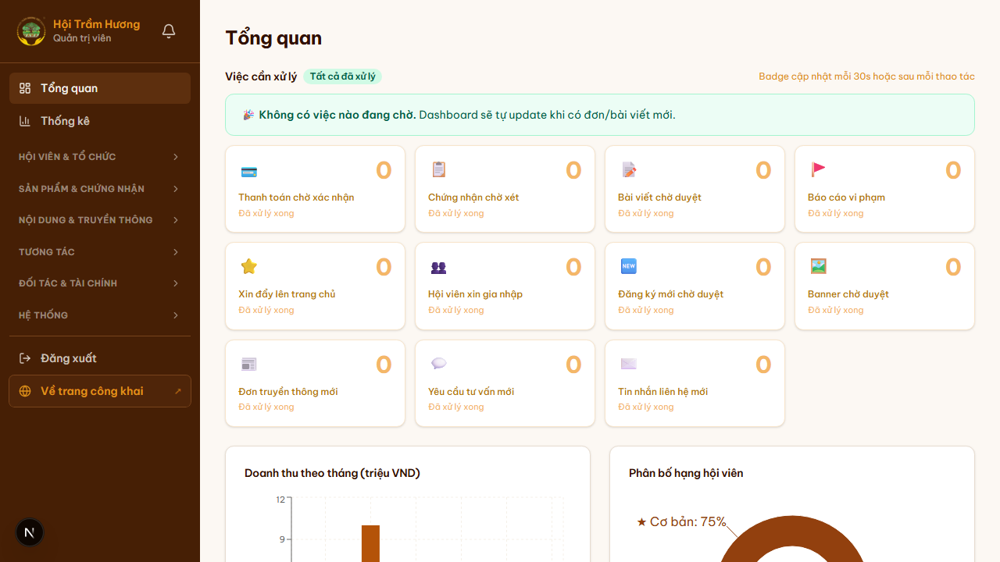
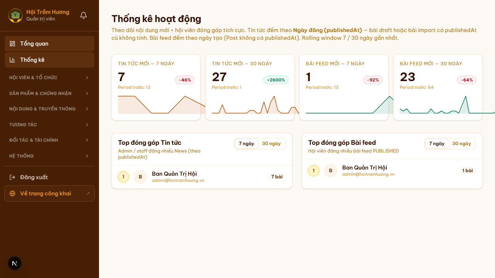
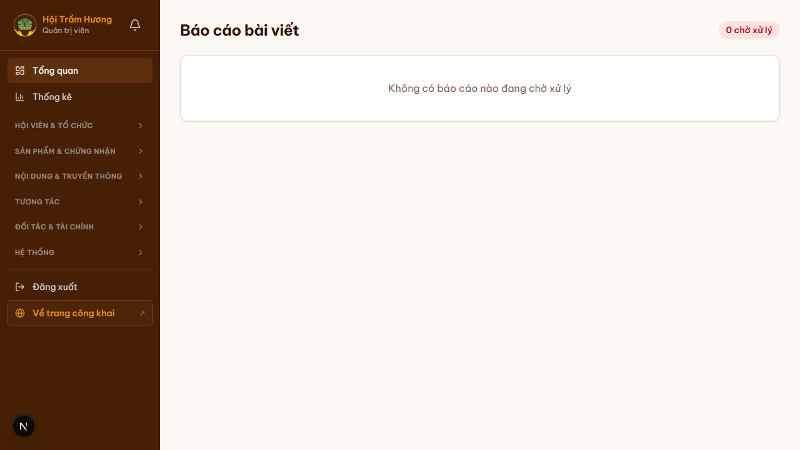
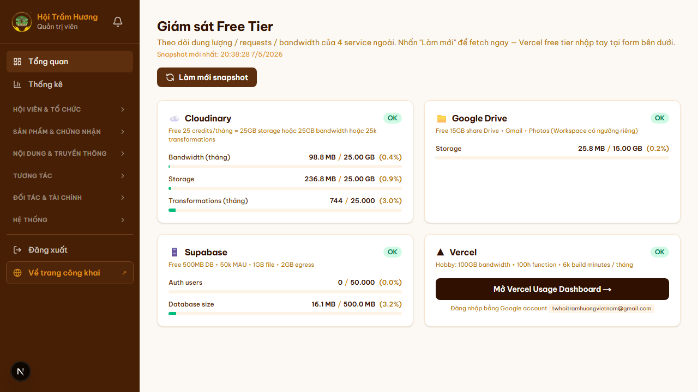

# 30. Admin — Dashboard quản trị tổng thể

## Mục đích
Trang **`/admin`** là dashboard tổng quan vận hành cho Admin: cảnh báo SLA, biểu đồ doanh thu 12 tháng, phân bố hạng hội viên, hoạt động gần đây, và lối tắt tới các mục cần xử lý.

## Đối tượng
- Admin (`role = ADMIN/INFINITE`).
- Hội viên có `committees.length > 0` (Ban Thư ký, Ban Truyền thông…) — vào được nhưng theo phân quyền chi tiết qua `lib/permissions.ts`.

## Đường dẫn
- URL: `/admin`
- Tự load khi click logo "Quản trị viên" hoặc menu "Tổng quan" trong sidebar admin.

## Bố cục

### 1. **Action Queue Badges** (đỏ + vàng — cảnh báo SLA)
Theo dõi các tình huống vi phạm SLA hoặc sắp cấp bách:

**🔴 Đỏ — quá hạn SLA**:
- Thanh toán PENDING quá 24h (chưa xác nhận).
- Đơn chứng nhận tồn đọng quá 7 ngày ở `PENDING/UNDER_REVIEW`.
- Báo cáo vi phạm chưa xử lý quá 48h.
- Membership hết hạn **trong hôm nay** (cần email gấp).

**🟡 Vàng — sắp cấp bách**:
- Membership hết hạn trong tuần tới.
- Đơn truyền thông NEW chưa confirm > 48h.
- Tài khoản VIP chờ kích hoạt (đã approve, chưa đặt mật khẩu).

→ Mỗi badge click vào sẽ filter sang trang tương ứng (`/admin/thanh-toan?status=pending`, `/admin/chung-nhan?status=under_review`, etc.).

### 2. **Bảng "Việc cần xử lý" + "Đã xử lý xong"**
Tab toggle 2 chế độ: badge cập nhật mỗi 30s hoặc sau mỗi thao tác.

12 thẻ liên kết tới các route vận hành:
- Thanh toán chờ xác nhận
- Chứng nhận chờ xét
- Bài viết chờ duyệt (post pending moderation)
- Báo cáo vi phạm
- Xin đẩy lên trang chủ (post pinned request)
- Hội viên xin gia nhập
- Đăng ký mới chờ duyệt
- Banner chờ duyệt
- Đơn truyền thông mới
- Yêu cầu tư vấn mới
- Tin nhắn liên hệ mới

### 3. **Biểu đồ doanh thu theo tháng** (BarChart 12 tháng)
Recharts BarChart, stack:
- **Phí membership** (xanh dương)
- **Phí chứng nhận** (vàng kim)
- **Phí truyền thông** (xanh lá)

Đơn vị **triệu VND** trục Y. Hover tooltip hiện chi tiết từng tháng.
Lấy từ `Payment.amount` với `status = SUCCESS`, range 12 tháng gần nhất.

### 4. **Phân bố hạng hội viên** (PieChart)
3 vành: ★ Cơ bản / ★★ Bạc / ★★★ Vàng.
Tính từ DB groupBy theo `accountType + contributionTotal` so với ngưỡng tier (lib/tier.ts).

### 5. **Hoạt động gần đây** (4 cột)
- **Thanh toán mới** (5 mục) — payment SUCCESS gần nhất.
- **Chứng nhận mới** — apply / approve / reject.
- **Truyền thông mới** — đơn media gần nhất.
- **Hội viên mới** — VIP Active mới đăng ký.

## Xuất báo cáo
Dashboard không xuất file trực tiếp; **xuất báo cáo** thực hiện ở 2 nơi chuyên biệt:

### A. Sổ quỹ thu chi (`/admin/thu-chi/bao-cao`)
- Báo cáo Thu/Chi theo khoảng thời gian (tháng, quý, năm, custom range).
- Xuất **CSV** hoặc **Excel** (`.xlsx`) — danh sách giao dịch + tổng kết.
- Lọc theo `Category` (Phí membership / Phí chứng nhận / Phí truyền thông / Chi vận hành / Chi sự kiện…).

### B. Thống kê hoạt động (`/admin/thong-ke`)
- Sparkline 7 ngày / 30 ngày cho:
  - Tin tức mới (theo `News.publishedAt`)
  - Bài feed mới (theo `Post.createdAt`)
- **Top đóng góp Tin tức** — admin / staff đăng nhiều News nhất.
- **Top đóng góp Bài feed** — Hội viên đăng nhiều bài feed PUBLISHED nhất.
- Nút **"Xuất CSV"** danh sách top contributor (nếu cần báo cáo nhân sự).

## Charts — kỹ thuật
- File: `app/(admin)/admin/DashboardCharts.tsx` (client component) load qua `DashboardChartsLoader.tsx` (suspense + dynamic import) → giảm bundle initial.
- Library: **Recharts 3.x**.
- Data: tính server-side trong `app/(admin)/admin/page.tsx`, truyền qua props (không fetch lại ở client).

## Read-only mode
- User chỉ có quyền đọc (vd thư ký nội dung) → vẫn thấy dashboard nhưng không vào được trang action (`/admin/thanh-toan/...`).

## Hình ảnh minh họa

**Dashboard quản trị (overview, có badges + charts)**

**Trang Thống kê hoạt động (sparkline + top contributors)**

**Báo cáo vi phạm (Reports — bài bị flag spam/fake/inappropriate)**

**Giám sát (Audit log)**

