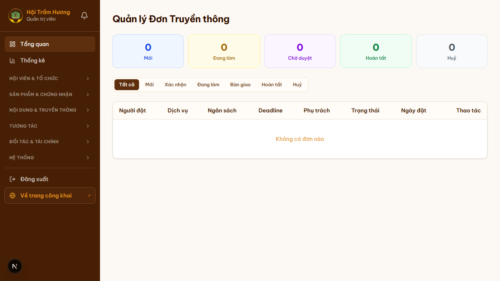
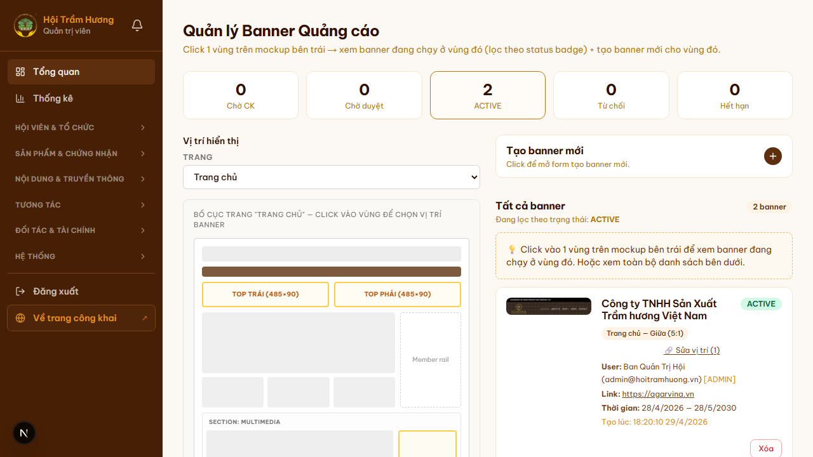
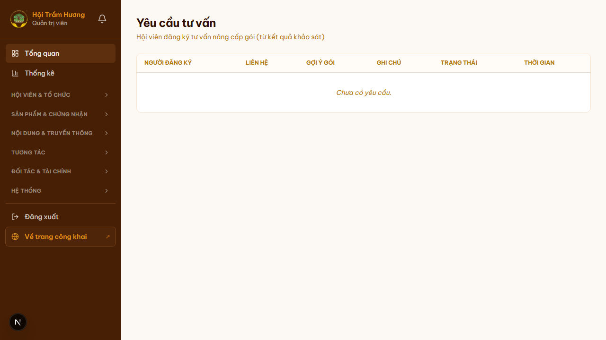
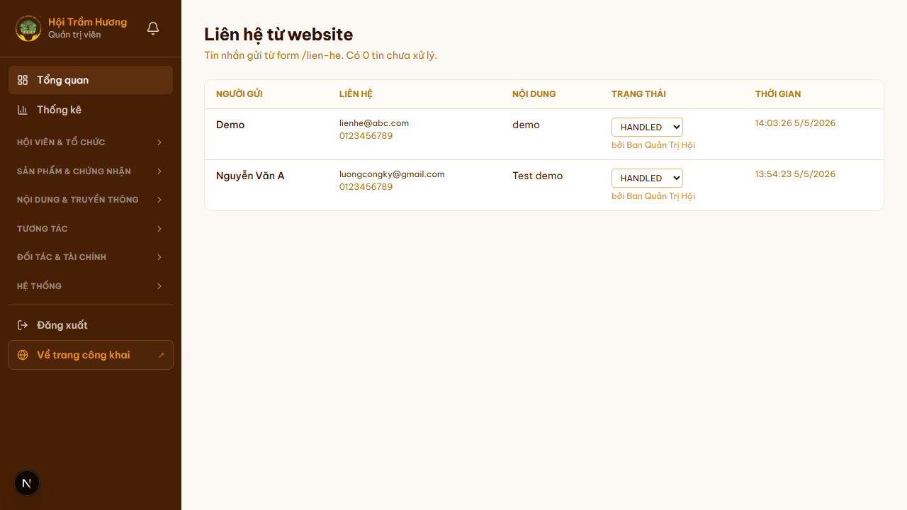
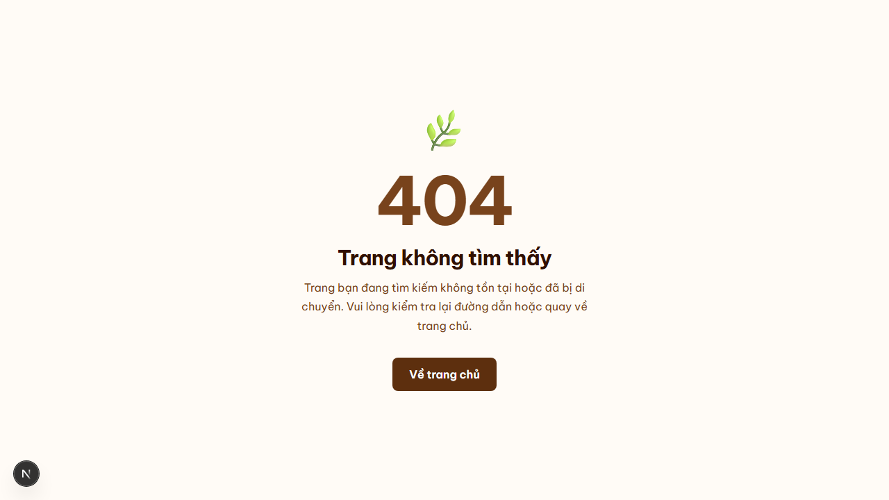

# 31. Module Dịch vụ Truyền thông + CRM nội bộ

## Mục đích
Bộ module phục vụ kinh doanh dịch vụ truyền thông của Hội cho hội viên + bên ngoài: **đơn truyền thông**, **banner quảng cáo**, **yêu cầu tư vấn**, **tin nhắn liên hệ**. Toàn bộ dữ liệu lưu DB → admin theo dõi như CRM mini.

## Đối tượng
- Admin / nhân viên Ban Truyền thông / Ban Thư ký.

## Đường dẫn

### Phía hội viên (self-service)
- Đăng ký banner: `/banner/dang-ky` *(yêu cầu đăng nhập)*
- Lịch sử banner đã đăng ký: `/banner/lich-su`
- Yêu cầu tư vấn nâng cấp gói: thường nhúng vào `/khao-sat` (sau khảo sát hội viên)
- Gửi tin nhắn liên hệ: `/lien-he` *(public)*

### Phía admin
- **Đơn truyền thông**: `/admin/truyen-thong`
- **Banner quảng cáo**: `/admin/banner`
- **Yêu cầu tư vấn**: `/admin/tu-van`
- **Tin nhắn liên hệ**: `/admin/lien-he`

## 1. Đơn truyền thông (`/admin/truyen-thong`)

### Tổng quan
Quản lý các đơn dịch vụ truyền thông hội viên / khách bên ngoài đặt hàng:
- Bài DN (`ARTICLE_COMPANY`) — viết bài giới thiệu doanh nghiệp.
- Bài SP (`ARTICLE_PRODUCT`) — viết bài giới thiệu sản phẩm.
- TCBC (`PRESS_RELEASE`) — biên soạn + phát hành thông cáo báo chí.
- MXH (`SOCIAL_CONTENT`) — content social media (Facebook, TikTok…).

### 7 trạng thái workflow
| Status | Ý nghĩa | Tiếp theo |
|---|---|---|
| `NEW` | Vừa nhận yêu cầu | Admin liên hệ + xác nhận giá |
| `CONFIRMED` | Đã xác nhận → chờ tiến hành | Phân công người làm |
| `IN_PROGRESS` | Đang triển khai | Bàn giao bản thử |
| `DELIVERED` | Đã bàn giao bản thử | Khách review |
| `REVISION` | Đang chỉnh sửa theo feedback | Bàn giao lại |
| `COMPLETED` | Hoàn tất + đã thanh toán đủ | Đóng đơn |
| `CANCELLED` | Khách hủy / không khả thi | — |

### Bố cục trang
- **5 thẻ summary**: Mới / Đang làm / Bàn giao / Hoàn tất / Hủy.
- **Tab filter** theo status.
- **Bảng đơn** với cột: Người đặt / Dịch vụ / Ngân sách / Deadline / Phụ trách / Trạng thái / Ngày đặt / Thao tác.
- Click "Chi tiết" → trang detail `/admin/truyen-thong/[id]` để cập nhật trạng thái, phân công, ghi note nội bộ.

## 2. Banner quảng cáo (`/admin/banner`)

### Tổng quan
Quản lý banner advertise xuất hiện trên website (trang chủ, sidebar, header...). Có 2 luồng:
- **Self-serve** (qua `/banner/dang-ky`): hội viên tự đăng ký + gắn link, đóng phí, admin duyệt.
- **Admin tạo trực tiếp** (qua `/admin/banner/tao-moi`): admin tạo cho đối tác lớn, deal offline.

### Các slot banner đang dùng
- **Trang chủ — Top trái** (485×90)
- **Trang chủ — Top phải** (485×90)
- **Trang chủ — Giữa** (HOMEPAGE_MID, full-width)
- **Section Multimedia** (banner ngang)
- **Member rail** (sidebar phải trang chủ)
- **Feed sidebar** (sidebar phải feed)

### 5 trạng thái
| Status | Ý nghĩa |
|---|---|
| Chờ CK | User đăng ký nhưng chưa CK đủ phí |
| Chờ duyệt | Đã CK, chờ admin review nội dung + ảnh |
| **ACTIVE** | Đang chạy live trên website |
| Từ chối | Admin reject (hoàn phí qua `/admin/thanh-toan`) |
| Hết hạn | Quá `endsAt` — auto chuyển expired bằng cron |

### UI điểm đặc biệt
Trang `/admin/banner` có **mockup trực quan**: hiển thị bố cục trang chủ, **click vào vùng nào** sẽ filter banner đang chạy ở vùng đó + cho phép tạo banner mới đúng vị trí.

### Đăng ký banner (hội viên — `/banner/dang-ky`)
3 bước:
1. **Chọn vị trí + thời gian** — chip slot × số tuần/tháng. Hệ thống hiện giá theo bảng phí (cấu hình SiteConfig).
2. **Upload ảnh + link đích** — ảnh đúng tỉ lệ slot, link redirect khi user click.
3. **Thanh toán** — tạo Payment với `description = HOITRAMHUONG-BANNER-<INITIALS>-<YYYYMMDD>`.

Sau khi admin xác nhận CK → banner chuyển ACTIVE đúng theo `startsAt`/`endsAt` đã chọn.

## 3. Yêu cầu tư vấn (`/admin/tu-van`)

### Tổng quan
Hội viên (đặc biệt từ kết quả khảo sát) đăng ký được tư vấn nâng cấp gói dịch vụ → admin liên hệ trực tiếp tư vấn / báo giá.

### 4 trạng thái
- `PENDING` — chờ liên hệ.
- `CONTACTED` — đã gọi/email.
- `DONE` — hoàn tất tư vấn.
- `CANCELLED` — không tư vấn nữa.

### Bố cục trang
- Bảng list 200 yêu cầu mới nhất.
- Cột: Hội viên (tên + email + accountType) / Nội dung tư vấn / Trạng thái / Ngày gửi / Người xử lý / Thao tác.
- Click "Cập nhật" → đổi status + ghi note xử lý.

## 4. Tin nhắn liên hệ (`/admin/lien-he`)

### Tổng quan
Đầu vào của tin nhắn từ form `/lien-he` (xem mục 5). Lưu vào `ContactMessage`. Mỗi tin nhắn:
- Họ tên + email + sđt
- Nội dung
- Trạng thái: Chưa đọc / Đã đọc / Đã xử lý
- Ngày gửi

### Bố cục trang
- Bảng list, mặc định lọc "Chưa đọc" lên trên.
- Click 1 row → mở rộng nội dung đầy đủ + nút Reply (mở mailto link với `Reply-To` đã set sẵn) + nút Đánh dấu đã xử lý.
- **Notification badge** trên admin sidebar — số tin chưa đọc.

## CRM mini — tích hợp xuyên suốt
Cả 4 module trên + **payment + certification + member registration** đều liên kết tới user (`User.id`) khi có thể → admin có thể nhìn 1 user → biết:
- Đã đặt bao nhiêu đơn truyền thông
- Đã chạy bao nhiêu banner
- Đã yêu cầu tư vấn lần nào
- Đã gửi liên hệ lần nào
- Lịch sử thanh toán đầy đủ

→ Vai trò CRM nội bộ: ngắn gọn nhưng đủ cho ngành nghề thủ công, không cần thuê HubSpot/Zoho.

## Hình ảnh minh họa

**Quản lý đơn truyền thông**

**Quản lý banner — UI mockup vị trí**

**Yêu cầu tư vấn**

**Tin nhắn liên hệ**

**Hội viên — Đăng ký banner**

**Hội viên — Lịch sử banner đã đăng ký**

