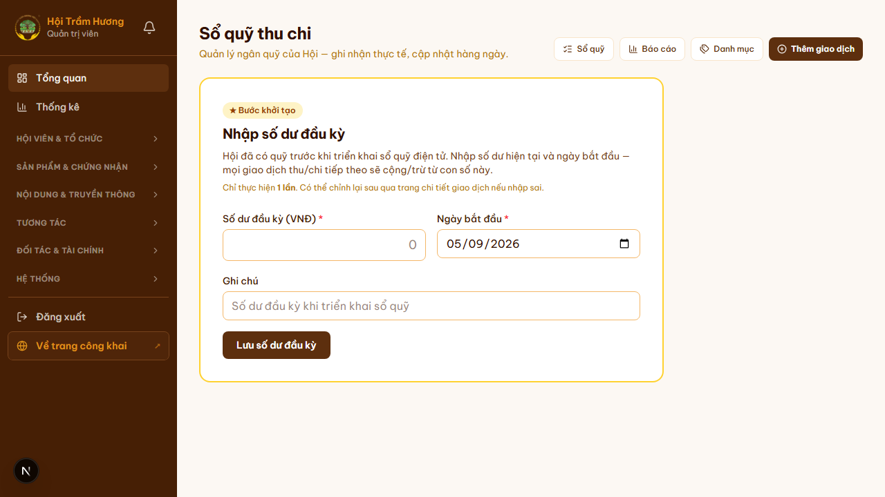
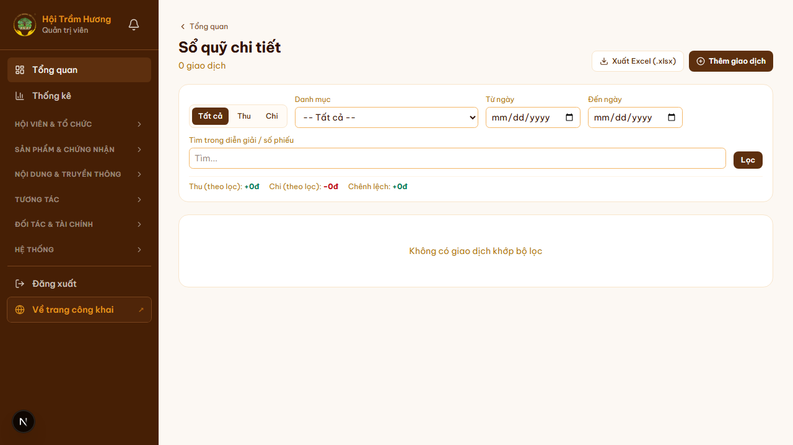
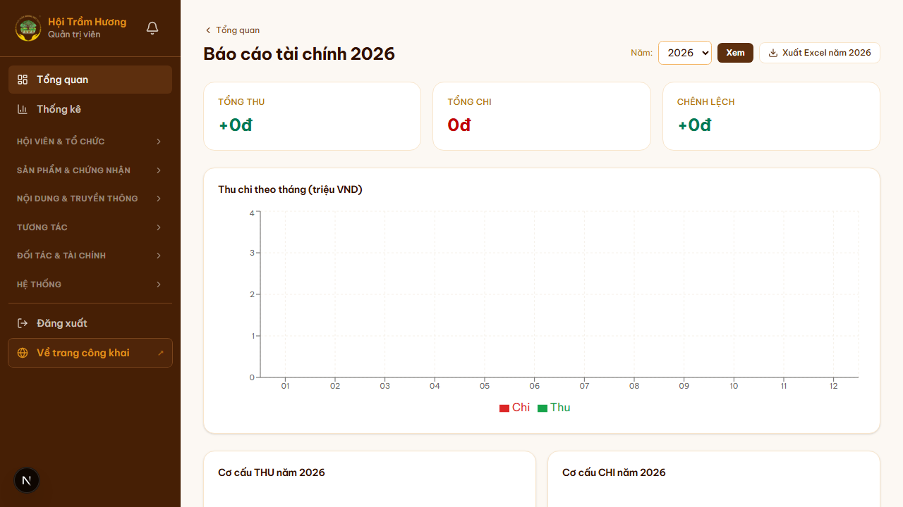
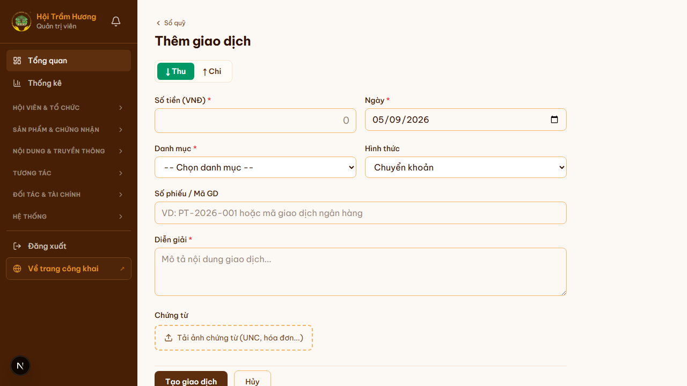

# 36. Admin — Sổ quỹ thu chi (Ledger)

## Mục đích
Module **kế toán đơn giản 1 tài khoản** cho Hội: ghi nhận mọi giao dịch thu — chi vào sổ quỹ điện tử, theo dõi số dư realtime, xuất báo cáo theo kỳ. Auto-record từ luồng xác nhận thanh toán → giảm việc thủ công.

## Đối tượng
- Admin có quyền `ledger:read` — xem.
- Admin có quyền `ledger:write` — thêm / sửa / xóa giao dịch.
- Hội viên thường: KHÔNG truy cập (admin-only feature).

## Đường dẫn
- **Tổng quan**: `/admin/thu-chi` — số dư hiện tại + tóm tắt tháng + giao dịch gần đây.
- **Sổ quỹ chi tiết**: `/admin/thu-chi/so-quy` — bảng full giao dịch + filter.
- **Báo cáo**: `/admin/thu-chi/bao-cao` — xuất CSV/Excel theo kỳ.
- **Danh mục**: `/admin/thu-chi/danh-muc` — quản lý category (Phí membership, Phí chứng nhận, Chi vận hành...).
- **Thêm giao dịch**: `/admin/thu-chi/them` — form nhập tay.
- **Chi tiết giao dịch**: `/admin/thu-chi/[id]`.

## Bước khởi tạo lần đầu (Opening Balance)
- Lần đầu vào `/admin/thu-chi` → wizard yêu cầu nhập **Số dư đầu kỳ** + Ngày bắt đầu.
- Lý do: Hội đã có quỹ trước khi triển khai sổ điện tử — nhập snapshot hiện tại làm baseline.
- Sau khi lưu → tạo 1 giao dịch hệ thống `OPENING_BALANCE` không thể xóa.
- **Chỉ thực hiện 1 lần**. Có thể chỉnh lại qua trang chi tiết giao dịch nếu nhập sai.

## Cấu trúc dữ liệu
- `LedgerTransaction`:
  - `type`: `INCOME` (thu) / `EXPENSE` (chi)
  - `amount`: số tiền (luôn dương; type quyết định cộng/trừ)
  - `transactionDate`: ngày thực thu/chi (≠ ngày tạo bản ghi)
  - `categoryId` — phân loại
  - `description`
  - `linkedPaymentId` — link tới `Payment` nếu auto-record từ confirm flow
  - `linkedCertId` — link tới `Certification` nếu là refund khi REJECTED
- `LedgerCategory`:
  - Thu: Phí Membership, Phí Chứng nhận, Phí Truyền thông, Phí Banner, Tài trợ, Khác
  - Chi: Vận hành, Sự kiện, Đi lại Hội đồng (offline cert), Hoàn phí cert REJECTED, Khác

## Auto-record từ luồng thanh toán
Khi admin xác nhận `Payment.status = SUCCESS` ở `/admin/thanh-toan`:
- Tự tạo `LedgerTransaction(type=INCOME, amount, category=...)` với `linkedPaymentId`.
- KHÔNG cần admin nhập tay → giảm sai sót + đảm bảo sổ quỹ đồng bộ với payment.

Khi cert REJECTED + admin hoàn tiền cho applicant:
- Tự tạo `LedgerTransaction(type=EXPENSE, amount, category=Hoàn phí cert)` với `linkedCertId`.

## Bố cục `/admin/thu-chi` (Dashboard)
1. **Header** "Sổ quỹ thu chi" + 4 nút action: Sổ quỹ / Báo cáo / Danh mục / + Thêm giao dịch.
2. **3 thẻ summary**:
   - **Số dư hiện tại** (lớn, format VND đầy đủ).
   - **Thu — Chi tháng này** (so với tháng trước, % delta).
   - **Thu — Chi năm nay** (so với năm trước).
3. **Giao dịch gần đây** — bảng 10 mục mới nhất.

## Trang Sổ quỹ chi tiết (`/admin/thu-chi/so-quy`)
- **Filter**: range ngày, type (Thu/Chi), category, search description.
- **Bảng đầy đủ**: ngày, type (icon mũi tên xuống/lên), amount, category, description, linked payment/cert (nếu có).
- **Pagination**.
- Từng row click → trang chi tiết để sửa / xóa (chỉ nếu `linkedPaymentId == null` — giao dịch auto-record không cho sửa).

## Trang Báo cáo (`/admin/thu-chi/bao-cao`)

### Báo cáo theo kỳ
- **Chọn kỳ**: Tháng / Quý / Năm / Custom range.
- **Group by**: Category / Source / Day.
- **Visualize**: bảng + biểu đồ cột thu vs chi.

### Xuất file
- **CSV** (UTF-8 with BOM cho Excel VN không lỗi font).
- **Excel `.xlsx`** với sheet:
  - Sheet 1: Tổng kết (Tổng thu, Tổng chi, Số dư đầu, Số dư cuối).
  - Sheet 2: Chi tiết giao dịch (mọi cột).
  - Sheet 3: Theo Category (group + sum).

### Báo cáo cho Hội đồng
- Báo cáo quý / năm để Hội đồng xét duyệt — admin export PDF qua trình duyệt (Print → Save as PDF).

## Phân quyền chi tiết
- `ledger:read` — Admin chính, Thủ quỹ, Phó Chủ tịch, Chánh Văn phòng.
- `ledger:write` — chỉ Thủ quỹ + Admin chính. Người khác chỉ xem.
- Read-only mode (qua AdminReadOnlyContext) → ẩn nút "+ Thêm giao dịch", "Sửa", "Xóa".

## Audit log
Mọi thay đổi (thêm / sửa / xóa) đều ghi vào `AuditLog` với userId + before/after để truy vết.

## Hình ảnh minh họa

**Sổ quỹ — bước nhập số dư đầu kỳ (lần đầu)**

**Sổ quỹ chi tiết**

**Trang Báo cáo (xuất CSV/Excel)**

**Form thêm giao dịch tay**

