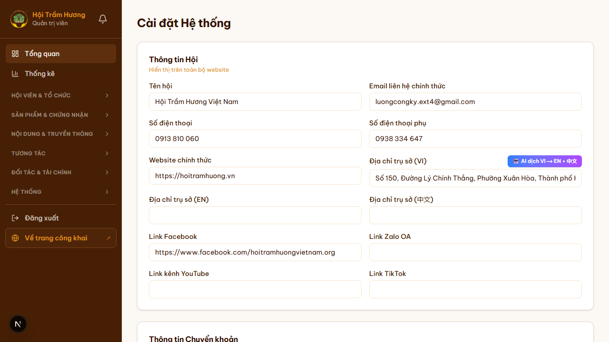
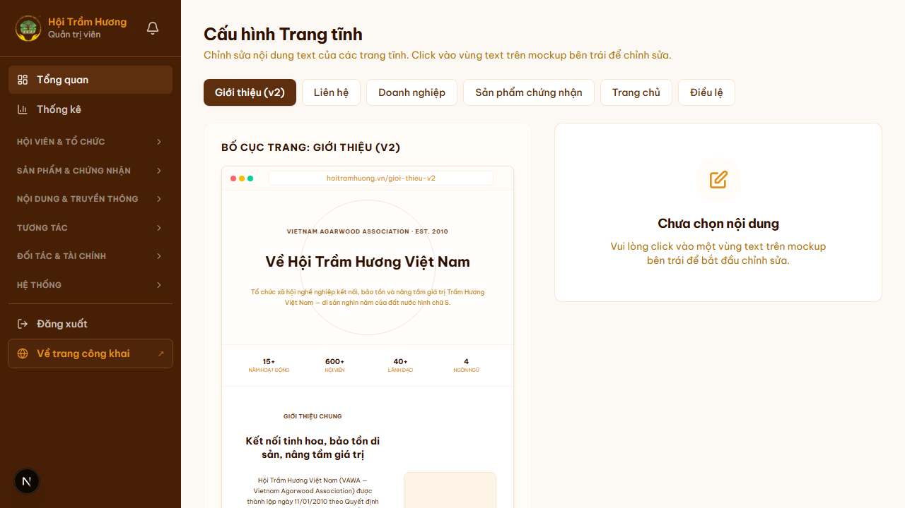
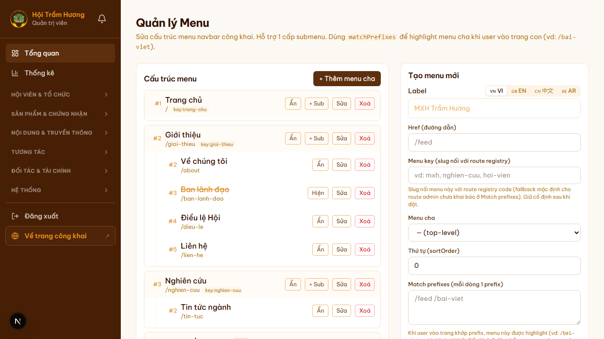

# 37. Admin — Cài đặt hệ thống & Trang tĩnh

## Mục đích
Cụm 3 trang admin để cấu hình các thông số chung của Hội + nội dung trang tĩnh + menu navigation. Toàn bộ giá trị lưu vào bảng `SiteConfig` (key-value), được dùng bởi mọi trang khác qua helper `getSiteConfig()`.

## Đối tượng
- Admin chính / Chánh Văn phòng (có quyền `settings:write`).

## Đường dẫn
- **Cài đặt hệ thống**: `/admin/cai-dat`
- **Trang tĩnh** (i18n editor): `/admin/trang-tinh`
- **Menu navigation**: `/admin/menu`

## 1. Cài đặt hệ thống (`/admin/cai-dat`)

### Khối "Thông tin Hội"
Hiển thị xuyên suốt website (footer, JSON-LD, email signature):
- Tên hội (`association_name`)
- Email liên hệ chính thức (`association_email`)
- Số điện thoại chính + phụ (`association_phone`, `association_phone_2`)
- Website chính thức (`association_url`)
- **Địa chỉ trụ sở** đa ngôn ngữ — VI / EN / 中文 / العربية
- Link Facebook, Zalo OA, YouTube, TikTok
- Có nút **"AI dịch VI → EN + 中文"** để tự dịch địa chỉ

### Khối "Thông tin Chuyển khoản"
Dùng cho trang Gia hạn / Chứng nhận / Banner — ai cũng phải biết STK của Hội:
- Tên ngân hàng (`bank_name`)
- Số tài khoản (`bank_account_number`)
- Tên chủ TK (`bank_account_name`)

### Khối "Phí + Quota"
- Phí membership: `membership_fee_min`, `membership_fee_max`
- Phí cá nhân: `individual_fee_min`, `individual_fee_max`
- Quota feed: `feed_quota_guest`, `feed_quota_silver`, `feed_quota_gold`
- Quota sản phẩm: `product_quota_guest`, `product_quota_silver`, `product_quota_gold`
- Slot tối đa hội viên VIP: `max_vip_accounts`

### Khối "Hội đồng & Chứng nhận"
- Phí offline cert: 200.000.000đ (cố định, hardcoded)
- Phí online cert: clamp(2% giá bán, 1tr — 20tr)
- Thời hạn cert: `CERT_VALIDITY_YEARS = 1` (hardcoded)
- Số reviewer: 5 (hardcoded)

### Khối "Văn bản pháp quy"
- File PDF Điều lệ (Google Drive ID + tên + size) — multi locale: `dieu_le_drive_file_id`, `dieu_le_drive_file_id_en`, etc.
- Upload PDF mới — qua Google Drive OAuth.

### Khối "Email & Resend"
- API key Resend (env, không edit qua UI vì lý do bảo mật).
- Override email recipient cho contact form (`CONTACT_INBOX_EMAIL`).

### Khối "SEO"
- Default OG image (`og_image_default`).
- Google Site Verification token.
- Bing Webmaster token.

### Khối "Cloudinary"
- Cloud name, API key, API secret (env, hiển thị read-only).

## 2. Trang tĩnh (`/admin/trang-tinh`)

### Mục đích
Cho phép admin sửa **mọi text tĩnh** trên các trang public (homepage, gioi-thieu, lien-he, dieu-le, cert products page, companies page) mà KHÔNG cần đụng code. Edit trực tiếp các key i18n + xem **mockup trực quan** bên cạnh.

### Bố cục
**Workbench split view**:
- **Cột trái**: thumbnail mockup các trang (Home / About / Companies / Cert Products / Dieu Le / Contact). Click thumbnail → nhảy section.
- **Cột phải**: editor 4 tab `[VI] [EN] [中文] [AR]` cho từng key text.

### Nút "AI dịch (Ngôn ngữ trống)"
- Mỗi key có nút dịch tự động VI → EN/ZH/AR (gọi Gemini API qua `/api/admin/ai/translate`).
- Hiển thị "Ngôn ngữ trống" → nhấn để fill các tab chưa có nội dung.

### Lưu thay đổi
- Save từng key hoặc Save All.
- Trigger revalidate tag tương ứng → UI public update trong vài giây.

## 3. Menu navigation (`/admin/menu`)

### Mục đích
Quản lý các mục menu hiển thị trên CategoryBar + footer. Có thể bật/tắt, đổi label, thêm sub-menu.

### Tính năng
- **Drag-and-drop** sắp xếp thứ tự menu items.
- Bật/tắt từng menu (vd ẩn "Tin báo chí" mà KHÔNG xóa route).
- Sửa label đa ngôn ngữ (4 tab) cho từng menu.
- Thêm sub-menu cho dropdown "Giới thiệu" hoặc tạo dropdown mới.

### Footer menus
- Tách section "Lãnh đạo Hội" / "Liên kết nhanh" / "Liên hệ" / "Giờ làm việc" — admin sửa từng cột riêng biệt.

## SiteConfig — bảng key-value
Tất cả setting trên đều lưu chung 1 bảng:
```
SiteConfig {
  key: string  @unique
  value: string  // raw, có thể là JSON stringify cho object phức tạp
  updatedAt
}
```

Helper `getSiteConfig(key)` cache 60s in-memory để tránh query DB nhiều lần / request.

## Hình ảnh minh họa

**Cài đặt hệ thống — thông tin Hội + ngân hàng**



**Trang tĩnh — workbench với mockup + editor 4 tab**



**Menu navigation**


