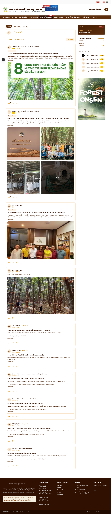
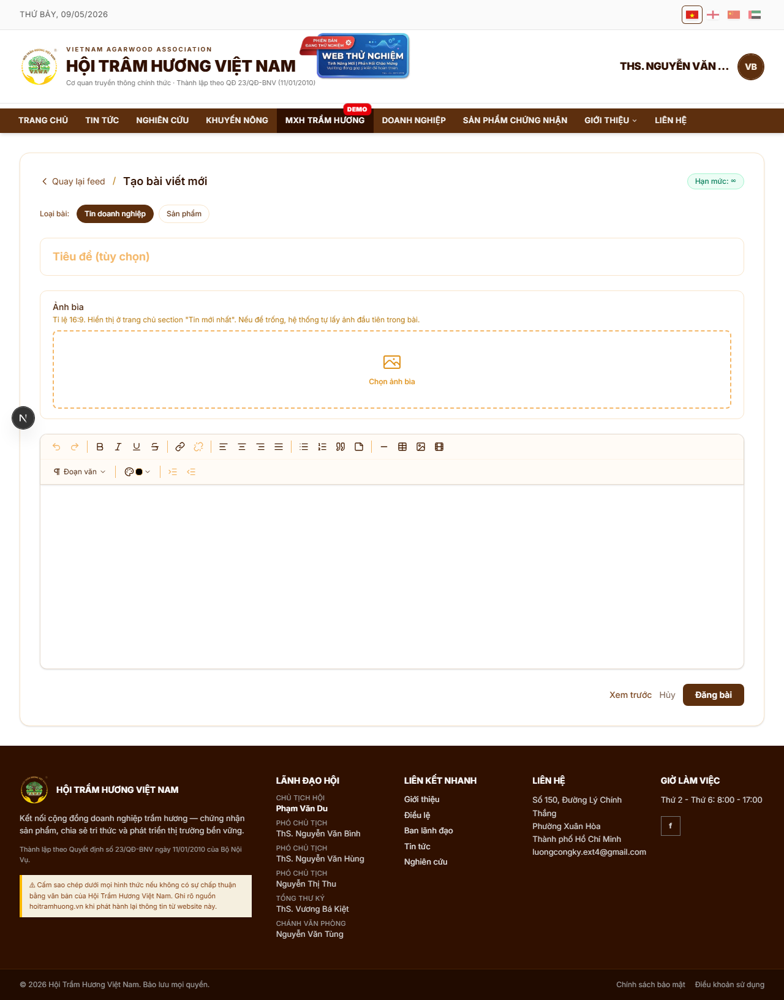
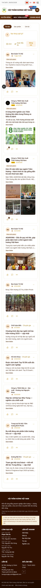

# 21. Feed cộng đồng (MXH Trầm Hương)

## Mục đích
Mạng xã hội nội bộ của Hội — cho phép hội viên đăng bài chia sẻ kinh nghiệm, sản phẩm, tin nội bộ; xem feed của cộng đồng; comment & like.

> **Đang là tính năng demo** — menu trên CategoryBar có badge **"Demo"** nhắc nhở.

## Đối tượng
- Hội viên (đã đăng nhập). Khách → ép đăng nhập trước.
- Quota theo hạng (xem bên dưới).

## Đường dẫn
- Feed list: `/feed` (locale-aware: `/vi/feed`, `/en/feed`...)
- Tạo bài đầy đủ: `/feed/tao-bai`
- Bài chi tiết: `/feed/<id>`

## Bố cục Feed (`/feed`)
1. **Inline Post Creator** (đầu trang) — bo tròn 1 dòng kiểu Facebook ("Bạn muốn chia sẻ điều gì?").
   - Click → mở rộng panel với editor TipTap, picker Loại bài, nút Đăng.
   - Có nút **"Soạn đầy đủ"** → chuyển sang trang `/feed/tao-bai` (editor full screen, có upload nhiều ảnh, video).
2. **Loại bài** (chọn khi đăng) — chip 3 lựa chọn:
   - **GENERAL** — chia sẻ chung
   - **NEWS** — tin doanh nghiệp / sự kiện (sẽ vào section "Tin doanh nghiệp" trang chủ)
   - **PRODUCT** — khoe sản phẩm (vào section "Tin sản phẩm" trang chủ)
3. **Chip quota hiển thị** — góc phải inline creator: **"Còn lại: X/Y bài tháng này"** (vd "Còn lại: 8/10 bài").
4. **Danh sách feed**:
   - Sort theo `createdAt` desc.
   - Lazy-load 10 bài/lần.
   - Mỗi card: avatar + tên + chip loại bài + thời gian + nội dung + ảnh + nút Like + Comment.
5. **Sidebar phải** (desktop ≥ lg):
   - Banner ngang (slot `FEED_SIDEBAR`)
   - Tin nổi bật + đề xuất hội viên kết bạn
6. **Lightbox** click ảnh → xem full + zoom.

## Quota đăng bài
Tính trong **tháng dương lịch hiện tại**, reset ngày 1 hàng tháng:

| Vai trò | Quota mặc định |
|---|---|
| GUEST (Tài khoản cơ bản) | 5 bài/tháng |
| Hội viên ★ (Đồng) | 15 bài/tháng |
| Hội viên ★★ (Bạc) | 30 bài/tháng |
| Hội viên ★★★ (Vàng) | Không giới hạn |
| Admin | Không giới hạn |

> Quota có thể override qua SiteConfig (`feed_quota_guest`, `feed_quota_silver`, etc.).

## Đăng bài đầy đủ (`/feed/tao-bai`)
Editor full screen với:
- **Tiêu đề** (tùy chọn — bỏ trống thì tự lấy ~80 ký tự đầu của body).
- **Ảnh bìa** — 1 ảnh chính, hiển thị trong card feed list.
- **Body** — TipTap rich text + image inline + YouTube embed + table + quote.
- **Loại bài** — chip 3 lựa chọn (GENERAL / NEWS / PRODUCT).
- **Bản nháp / Đăng bài** — nút riêng.

## Optimistic UI
- Khi user nhấn **Đăng**, post xuất hiện ngay trên đầu feed (state local).
- Server xử lý ngầm; nếu fail → hiện toast lỗi + xóa optimistic post.

## Comment + Like
- Mỗi post có ô comment dạng inline.
- Like 1 bấm — count cập nhật optimistic.
- Comment bị admin / chủ bài xóa → biến mất khỏi tree.

## Sanitize bài viết
- Server sanitize HTML khi POST/PUT (white-list các tag an toàn).
- Client KHÔNG ship DOMPurify → giảm bundle.

## Auto-promote / Auto-unpromote
- Bài post có flag "đẩy lên trang chủ" (admin pin) — sau 2 ngày tự bỏ ghim (cron — commit `bca7b16`).

## Hình ảnh minh họa

**Feed list (full page)**

**Trang tạo bài đầy đủ**

**Feed — mobile**

