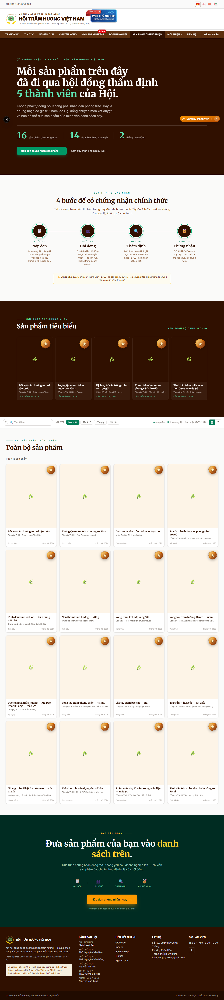
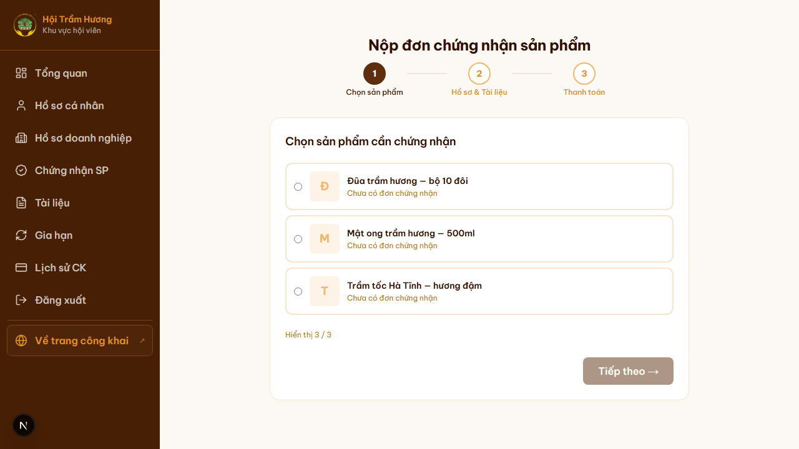
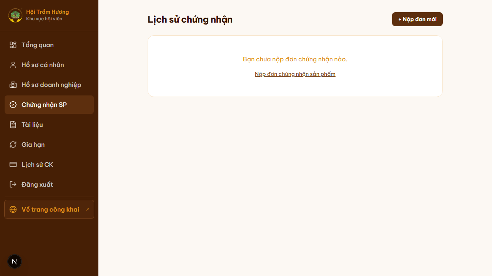
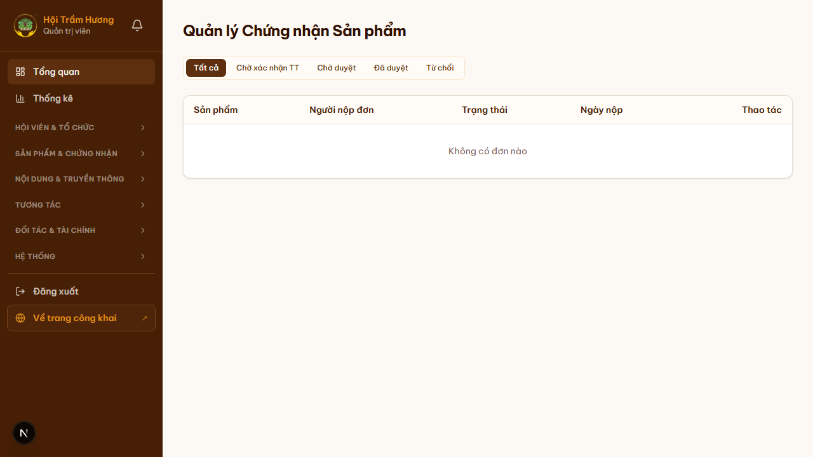

# 22. Module chứng nhận sản phẩm (end-to-end)

## Mục đích
Quy trình chứng nhận sản phẩm trầm hương theo Điều lệ Hội. Doanh nghiệp nộp đơn → đóng phí → Hội đồng thẩm định 5 người vote → cấp giấy chứng nhận PDF kèm QR xác thực, hoặc từ chối + hoàn phí.

## Đối tượng
- **Hội viên Doanh nghiệp** (`accountType = "BUSINESS"`) — nộp đơn.
- **Hội đồng thẩm định** (5 user được admin cấu hình) — vote.
- **Admin / Thủ quỹ** — xác nhận thanh toán + theo dõi tiến độ.
- **Public** — xác thực giấy chứng nhận tại `/chung-nhan/xac-thuc/<certCode>`.

## Đường dẫn

### Phía Doanh nghiệp
- Nộp đơn: `/chung-nhan/nop-don` (3 bước: Chọn sản phẩm → Hồ sơ + Tài liệu → Thanh toán)
- Lịch sử đơn của tôi: `/chung-nhan/lich-su`

### Phía Hội đồng thẩm định
- Bảng đơn cần vote: `/hoi-dong` (chỉ hiện cho user thuộc HDTD)

### Phía Admin
- Quản lý đơn: `/admin/chung-nhan`
- Quản lý hội đồng: `/admin/hoi-dong-tham-dinh`

### Public
- Trang sản phẩm đã chứng nhận: `/san-pham-chung-nhan`
- Xác thực 1 chứng nhận cụ thể: `/chung-nhan/xac-thuc/<certCode>` — public, scan QR đi tới đây
- Trang chi tiết sản phẩm có badge **"Đã chứng nhận VAWA"**: `/san-pham/<slug>`

## 6 trạng thái chứng nhận

| Trạng thái | Ý nghĩa | Hành động kế tiếp |
|---|---|---|
| `PENDING` | Vừa nộp đơn, chờ xác nhận thanh toán | Doanh nghiệp chuyển khoản phí |
| `PAID` | Đã đóng phí, chờ kích hoạt hội đồng | Admin assign hội đồng (auto hoặc tay) |
| `UNDER_REVIEW` | Hội đồng đang thẩm định (5 user vote) | Chờ đủ 5/5 phiếu |
| `APPROVED` | Đã được duyệt — cấp PDF + badge | Hệ thống sinh PDF, gửi email, hiển thị badge |
| `REJECTED` | Bị từ chối (≥ 1 phiếu REJECT khi đủ 5/5) | Hoàn phí cho DN qua tài khoản đã khai trong hồ sơ |
| `EXPIRED` | Quá 1 năm kể từ APPROVED | DN phải nộp lại đơn từ đầu (không có flow renew rút gọn) |

## 2 hình thức thẩm định
- **OFFLINE** — thẩm định tại chỗ (sản phẩm lớn, giá trị cao). Phí **flat 200.000.000đ** all-inclusive.
- **ONLINE** — thẩm định từ xa (sản phẩm nhỏ). Phí = `clamp(productSalePrice × 2%, 1.000.000, 20.000.000)`.

## Hội đồng thẩm định (HDTD)

### Quy tắc
- 5 user được admin chọn (User trong DB có quyền login).
- Quyết định cuối **chốt khi đủ 5/5 phiếu**:
  - **5 APPROVE → APPROVED**.
  - **≥ 1 REJECT → REJECTED** (giữ tinh thần veto, nhưng chỉ chốt sau khi đủ 5).
- Mỗi reviewer **bắt buộc để lại comment** khi vote (cả APPROVE lẫn REJECT).
- **Cho phép đổi vote** trước khi đủ 5/5 — chống trường hợp click nhầm REJECT veto đơn ngay.
- **Không có deadline vote** — đơn có thể ở UNDER_REVIEW vô hạn. Admin có dashboard monitor đơn tồn đọng quá lâu.

## Quy trình chi tiết — phía Doanh nghiệp

### Bước 1 — Chọn sản phẩm
- Hiển thị danh sách sản phẩm DN đang sở hữu.
- Sản phẩm đã có đơn chứng nhận (record `Certification` đang active) → **không chọn được**, dù `certStatus` cũ là gì. Block theo `Certification` chứ không phải `certStatus`.

### Bước 2 — Hồ sơ + Tài liệu
- Mô tả chi tiết sản phẩm (loại trầm, vùng nguyên liệu, quy trình…).
- Upload tài liệu: bằng đăng ký nhãn hiệu, kết quả phân tích phòng lab, ảnh sản phẩm chi tiết...
- File lưu Google Drive (PDF, DOCX, ảnh).

### Bước 3 — Thanh toán
- Hệ thống tính phí (OFFLINE 200tr / ONLINE = clamp 2% giá bán).
- Tạo Payment với `description = HOITRAMHUONG-CERT-<INITIALS>-<YYYYMMDD>`.
- DN chuyển khoản → admin xác nhận.

## Cấp giấy chứng nhận PDF
Khi cert chuyển APPROVED, hệ thống sinh PDF gồm:
- Mộc đỏ + chữ ký Chủ tịch Hội (placeholder hiện tại — KH sẽ thay sau).
- 5 comment của reviewers (đầy đủ tên).
- **certCode**: `HTHVN-<YYYY>-<NNNN>` (vd `HTHVN-2026-0042`).
- **QR code** dẫn tới `/chung-nhan/xac-thuc/<certCode>` để bên thứ 3 verify.
- Thời hạn: **1 năm** (`CERT_VALIDITY_YEARS = 1` ở `lib/certification-council-constants.ts`).

## Hiển thị badge
- Sản phẩm `APPROVED` → badge **"Đã chứng nhận VAWA"** ở trang chi tiết, list sản phẩm, marketplace.
- Marketplace sort: Certified → Featured → ownerPriority desc → createdAt desc.

## Email tự động
- **APPROVED** → email cảm ơn + link tải PDF + QR xác thực.
- **REJECTED** → email thông báo + lý do tổng hợp + thông tin **hoàn phí**: số tiền + ngân hàng đã khai trong tab "Ngân hàng" của hồ sơ.

## Hình ảnh minh họa

**Trang công khai sản phẩm đã chứng nhận**

**Form nộp đơn — Bước 1: Chọn sản phẩm**

**Lịch sử đơn của hội viên**

**Admin — quản lý đơn chứng nhận**

