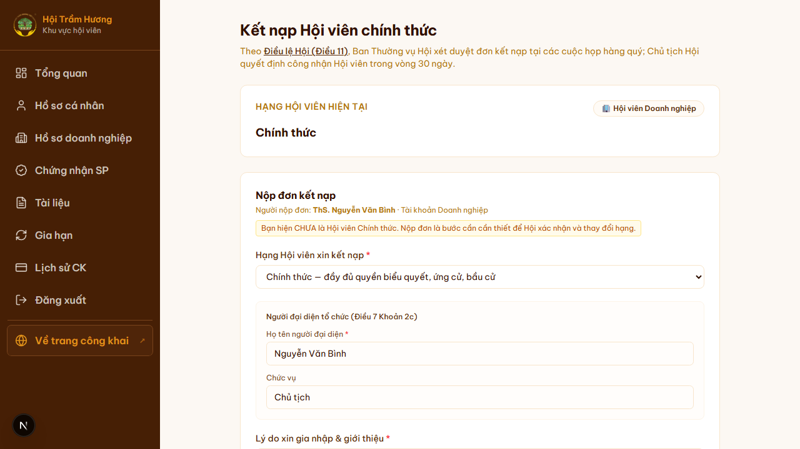
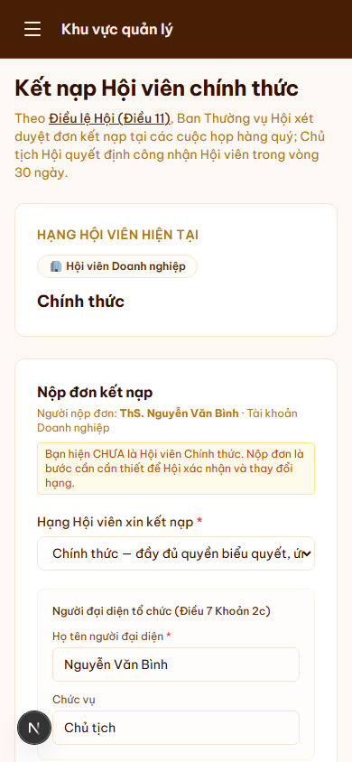

# 23. Đơn kết nạp Hội viên chính thức

## Mục đích
Theo Điều lệ Hội (Điều 11), Ban Thường vụ Hội xét duyệt đơn kết nạp tại các cuộc họp hàng quý; Chủ tịch Hội quyết định công nhận Hội viên trong vòng 30 ngày. Trang `/ket-nap` cho hội viên đang ở **hạng "Cơ bản"** nộp đơn xin nâng lên **"Chính thức"** với đầy đủ quyền biểu quyết, ứng cử, bầu cử.

## Đối tượng
- Hội viên đã đăng nhập, **chưa phải Hội viên chính thức** (vd đang là Tài khoản cơ bản, hoặc Hội viên cơ bản chưa được công nhận chính thức).
- Hội viên chính thức rồi → trang hiển thị thông báo "Bạn đã là Hội viên chính thức" thay vì form.

## Đường dẫn
- URL: `/ket-nap`
- Cách vào: từ Tổng quan → notification "Bạn chưa là Hội viên Chính thức" → link, hoặc gõ thẳng URL.

## Bố cục

### 1. Header thông tin pháp lý
Trích Điều 11 Điều lệ Hội + ghi rõ "Ban Thường vụ Hội xét duyệt tại các cuộc họp hàng quý; Chủ tịch quyết định công nhận trong vòng 30 ngày."

### 2. Card "Hạng Hội viên hiện tại"
- Hiển thị hạng đang có (vd "Chính thức", "Cơ bản") + chip loại tài khoản (Hội viên Doanh nghiệp / Cá nhân).

### 3. Form "Nộp đơn kết nạp"
- **Người nộp đơn** (read-only) — họ tên + loại tài khoản.
- **Cảnh báo** nếu chưa là Hội viên chính thức: "Bạn hiện CHƯA là Hội viên Chính thức. Nộp đơn là bước cần thiết để Hội xác nhận và thay đổi hạng."
- **Hạng Hội viên xin kết nạp** — dropdown:
  - Chính thức — đầy đủ quyền biểu quyết, ứng cử, bầu cử.
  - (Có thể có các option khác tùy cấu hình.)
- **Người đại diện tổ chức** (Điều 7 Khoản 2c — đối với Hội viên Doanh nghiệp):
  - Họ tên người đại diện
  - Chức vụ
- **Lý do xin gia nhập & giới thiệu** — text dài.
- **Tài liệu kèm theo** (tùy chọn) — đơn xin gia nhập có dấu mộc, bản photo CCCD, ĐKKD…
- Nút **"Nộp đơn"**.

## Quy trình duyệt đơn
1. Hội viên nộp đơn → server lưu vào `MembershipApplication` với `status = PENDING`.
2. Email thông báo gửi tới admin.
3. Admin review đơn ở `/admin/hoi-vien/don-ket-nap`.
4. Ban Thường vụ họp định kỳ → đánh dấu APPROVED / REJECTED qua trang admin.
5. Nếu APPROVED:
   - Cập nhật `User.role = "VIP"` (hoặc theo hạng tương ứng).
   - Gửi email kèm Quyết định công nhận (PDF — tùy cấu hình).
6. Nếu REJECTED:
   - Email thông báo lý do từ chối + hướng dẫn bổ sung hồ sơ.

## Lưu ý
- Trang **không thay thế** quy trình `/dang-ky` (đăng ký mới, từ chưa có tài khoản). `/ket-nap` chỉ dành cho người **đã có tài khoản** muốn nâng hạng.
- Đơn có thể tồn tại cùng lúc với membership hiện tại — vẫn login + dùng feature như bình thường, chỉ là chưa có quyền biểu quyết.
- KHÔNG có deadline tự động — có thể tồn đọng nếu Ban Thường vụ chưa họp.

## Hình ảnh minh họa

**Form Kết nạp — desktop**

**Form Kết nạp — mobile**

