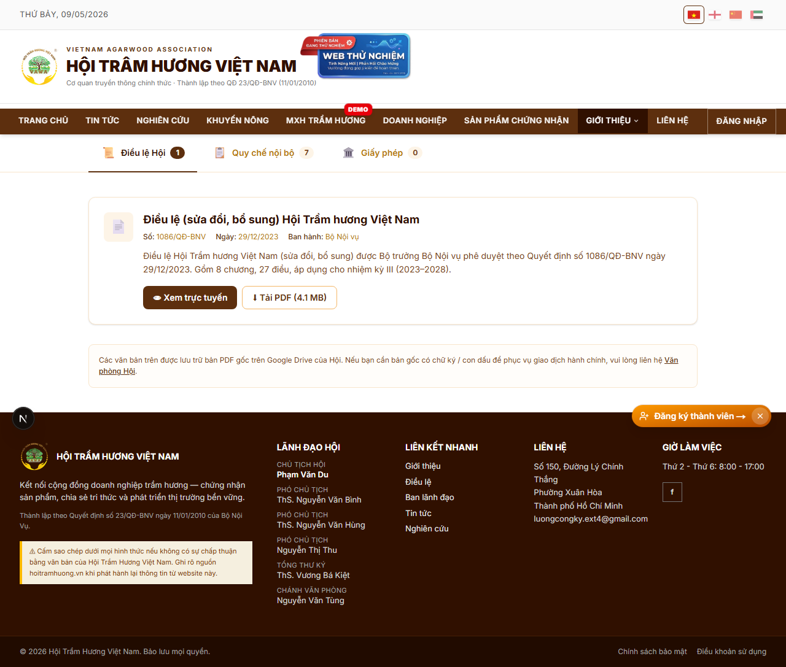
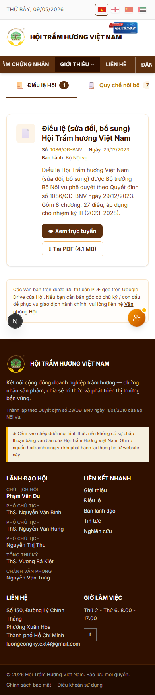
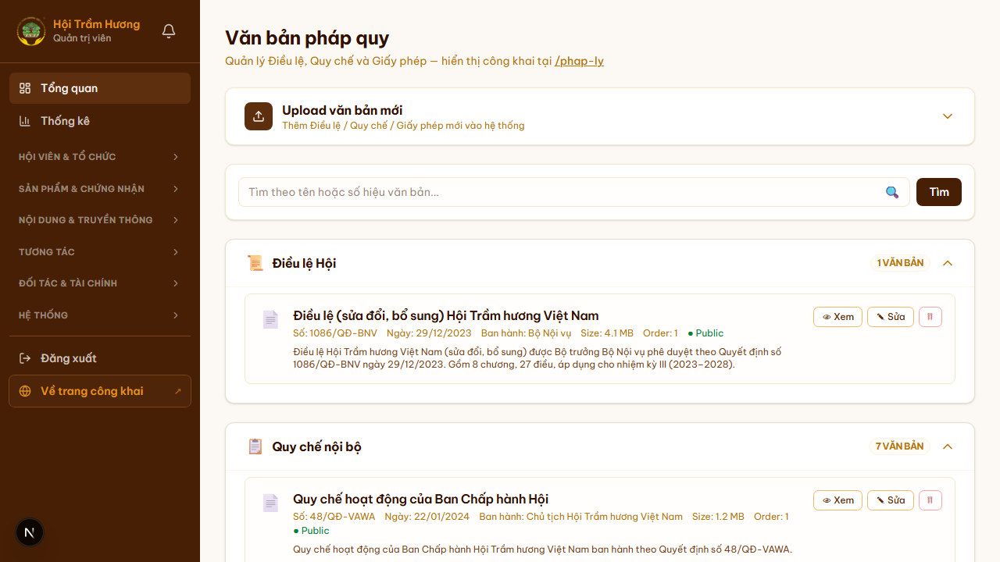

# 24. Văn bản pháp quy (`/phap-ly`)

## Mục đích
Tổng hợp các văn bản pháp quy liên quan đến Hội: Điều lệ, Quy chế nội bộ, Giấy phép hoạt động, Quyết định Bộ Nội vụ, Văn bản chỉ đạo… để hội viên + khách công khai tra cứu, tải về.

## Đối tượng
- **Public** — đọc + tải xuống.
- **Admin** — upload, sửa, xóa văn bản qua `/admin/phap-ly`.

## Đường dẫn
- Public: `/phap-ly`
- Admin: `/admin/phap-ly`

## Trang Public (`/phap-ly`)

### Bố cục
- Header tiêu đề "Văn bản pháp quy".
- **Danh sách văn bản nhóm theo loại** (collapsible accordion):
  - **Điều lệ Hội** (1 văn bản)
  - **Quy chế nội bộ** (Quy chế Ban Chấp hành, Ban Kiểm tra…)
  - **Giấy phép hoạt động**
  - **Quyết định** (của Bộ Nội vụ, Chủ tịch Hội…)
  - **Văn bản khác**
- Mỗi văn bản hiển thị:
  - Số hiệu văn bản (vd `1086/QĐ-BNV`)
  - Ngày ban hành
  - Cơ quan ban hành (vd "Bộ Nội vụ")
  - Dung lượng file
  - Mô tả ngắn
  - Nút **"Xem"** → Google Drive viewer
  - Badge **"Public"** (luôn vì đây là trang công khai)

### Tìm kiếm
- Ô search theo tên hoặc số hiệu văn bản (top of page) — match prefix + substring.

## Trang Admin (`/admin/phap-ly`)

### Tính năng
1. **Upload văn bản mới** — accordion mở ra form:
   - Loại (Điều lệ / Quy chế / Giấy phép / Quyết định / Khác)
   - Tên văn bản
   - Số hiệu
   - Ngày ban hành
   - Cơ quan ban hành
   - Mô tả ngắn
   - File đính kèm (PDF) — upload Google Drive
   - Thứ tự sắp xếp (`order`)
   - Public / Private (private → chỉ hội viên hoặc admin xem)
2. **Tìm kiếm + filter**.
3. **Sửa / xóa** mỗi văn bản (icon).
4. **Drag-and-drop** sắp xếp thứ tự trong từng nhóm.

### File upload
- File PDF lưu trên **Google Drive** (folder cố định) — share link "anyone-with-link viewer".
- Cron đồng bộ định kỳ kiểm tra link còn sống (tránh drive xóa nhầm).

## Lưu ý
- Trang Public cache **24 giờ**; admin upload xong → revalidate tag `phap-ly` để hiện ngay.
- **Điều lệ Hội** có route riêng `/dieu-le` (xem mục 03) ngoài việc cũng xuất hiện trong `/phap-ly` — Điều lệ là văn bản pháp quy quan trọng nhất.

## Hình ảnh minh họa

**Trang công khai văn bản pháp quy**

**Pháp lý — mobile**

**Admin — quản lý văn bản pháp quy**

