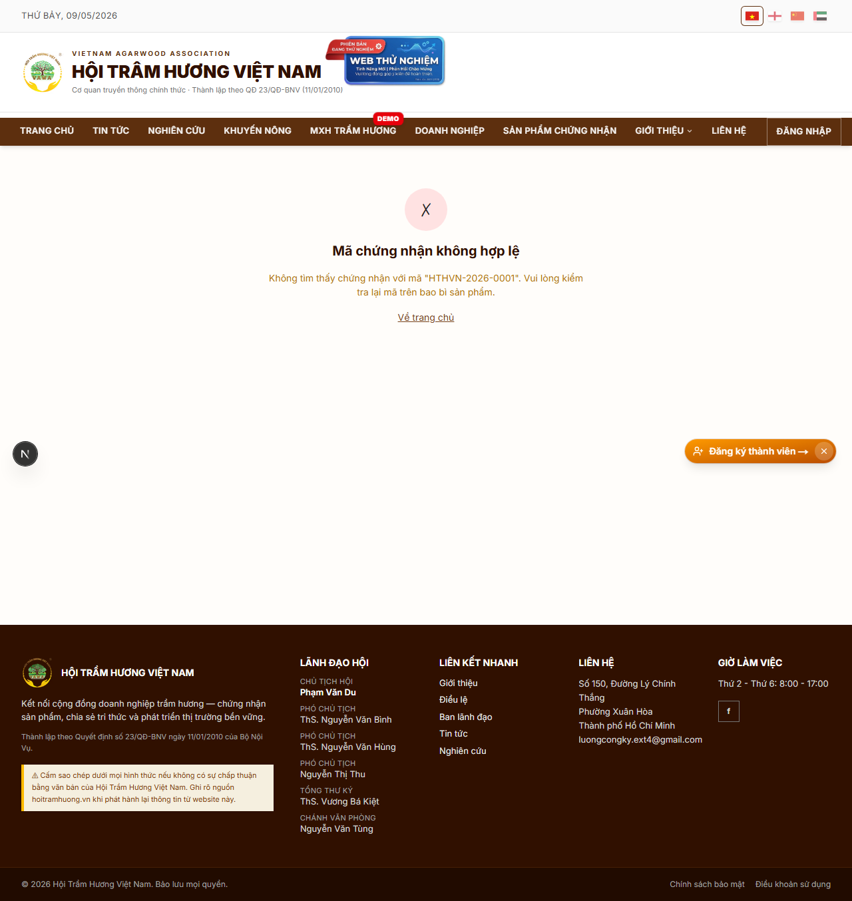
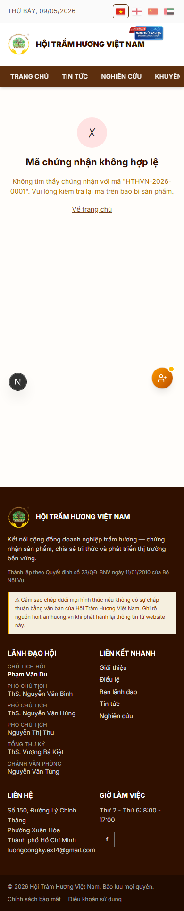

# 34. Xác thực chứng nhận sản phẩm (`/verify`)

## Mục đích
Trang công khai để bất kỳ ai (khách hàng, đối tác, cơ quan kiểm tra) **xác thực một giấy chứng nhận VAWA** dựa trên `certCode`. Không cần đăng nhập — chỉ cần URL hoặc scan QR.

## Đối tượng
- Public — bất cứ ai có URL hoặc QR code.

## Đường dẫn
- URL: `/verify/<certCode>`
- Format certCode: `HTHVN-YYYY-NNNN` (vd `HTHVN-2026-0042`).
- Cũng truy cập được qua menu CategoryBar → Sản phẩm → click bài Certified → link "Xác thực chứng nhận".

## Cách lấy URL xác thực
1. Khách hàng nhận sản phẩm → trên bao bì có **QR code** in kèm.
2. Scan QR bằng điện thoại → mở browser dẫn tới `/verify/<certCode>`.
3. Hoặc admin chia sẻ link cho đối tác qua email.

## Bố cục trang

### Trường hợp `certCode` HỢP LỆ + cert APPROVED
1. **Header xanh** — biểu tượng tick + dòng "Chứng nhận hợp lệ".
2. **Thông tin chứng nhận**:
   - certCode (`HTHVN-2026-0042`)
   - Ngày cấp + ngày hết hạn (`certApprovedAt` + `certExpiredAt = approved + 1 year`)
   - Trạng thái hiện tại (Còn hiệu lực / Đã hết hạn)
3. **Thông tin sản phẩm**:
   - Tên sản phẩm + ảnh chính
   - Doanh nghiệp sở hữu (link sang `/doanh-nghiep/<slug>`)
   - Loại / category sản phẩm
   - Link sang trang chi tiết SP `/san-pham/<slug>`
4. **5 nhận xét hội đồng thẩm định**:
   - Tên reviewer + chức danh + ngày vote
   - Comment nội dung review
5. **Mộc đỏ + chữ ký** Chủ tịch Hội (image, placeholder hiện tại).
6. **QR code** lớn ở bottom — copy URL trang này (in lại được).
7. **Nút "🖨 In trang"** — print giấy chứng nhận layout A4.

### Trường hợp `certCode` KHÔNG HỢP LỆ
- Header đỏ — biểu tượng X + "Mã chứng nhận không hợp lệ".
- Dòng giải thích: `"Không tìm thấy chứng nhận với mã 'HTHVN-2026-0001'. Vui lòng kiểm tra lại mã trên bao bì sản phẩm."`
- Link "Về trang chủ".
- **Vẫn render header / footer như mọi trang public** — không 404.

### Trường hợp cert đã EXPIRED hoặc REJECTED
- Header vàng — "Chứng nhận đã hết hạn" / đỏ — "Chứng nhận đã bị thu hồi".
- Vẫn hiển thị thông tin sản phẩm + cảnh báo rõ.
- Doanh nghiệp cần nộp đơn lại để có chứng nhận mới.

## Bảo mật & chống giả mạo
- `certCode` sinh tự động không dự đoán được (sequence theo năm + DB constraint).
- Pattern regex `/^HTHVN-\d{4}-\d{4,}$/` — kiểm tra format trước khi query DB → chống injection.
- Trang **read-only public** — KHÔNG có form nào, KHÔNG accept input từ user → tấn công kéo dài URL khó.
- Cache 5 phút (`revalidate = 300`) — sửa cert ở admin → tag revalidate kịp.

## Print layout
Trang có CSS `@media print` để in ra giấy chứng nhận chuẩn:
- Header trắng (ẩn navigation).
- Body căn giữa, font size lớn.
- QR + chữ ký Chủ tịch + mộc đỏ visible.
- Footer in URL `verify/<certCode>` để xác minh online.

## Hình ảnh minh họa

**Trang xác thực — mã không hợp lệ (case fallback)**

**Mobile**

> **Lưu ý**: trang screenshot này là case **không tìm thấy** (do dev seed chưa có cert APPROVED nào với mã `HTHVN-2026-0001`). Trên production khi đã có cert thực, trang sẽ hiển thị đầy đủ thông tin sản phẩm + 5 nhận xét hội đồng + QR + nút In.
