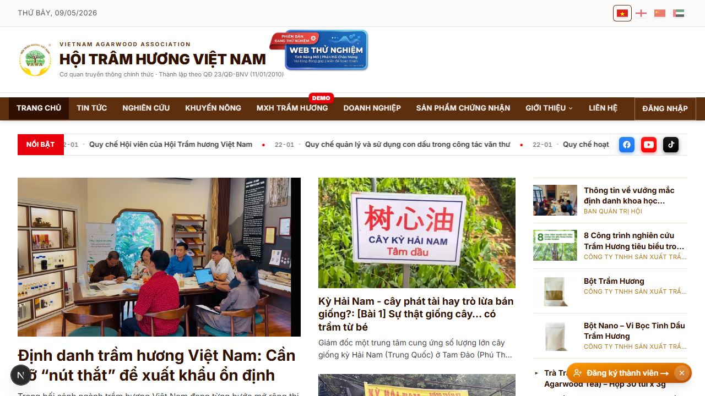
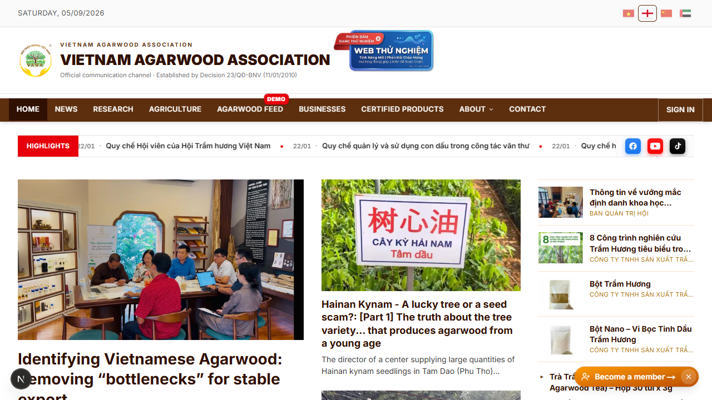
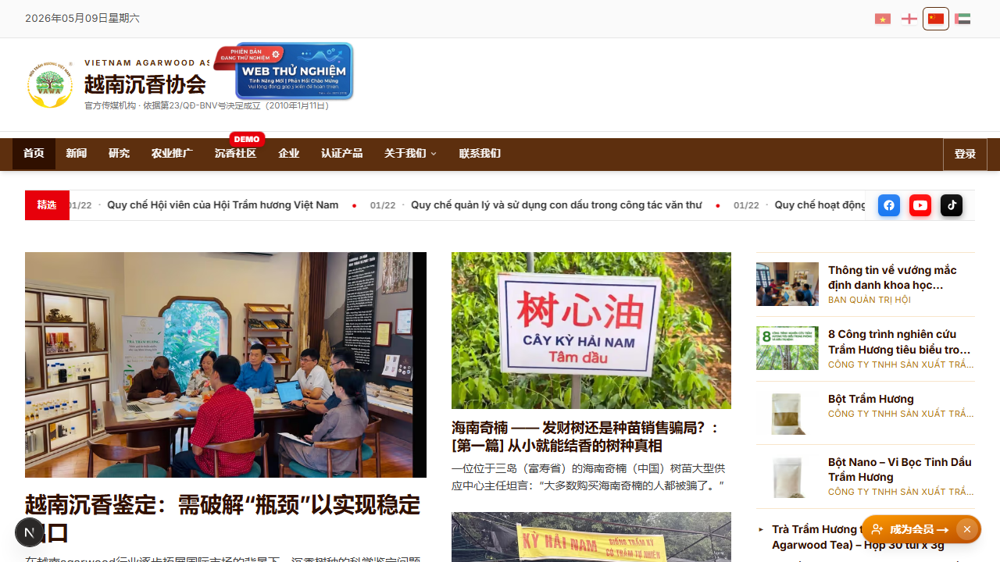
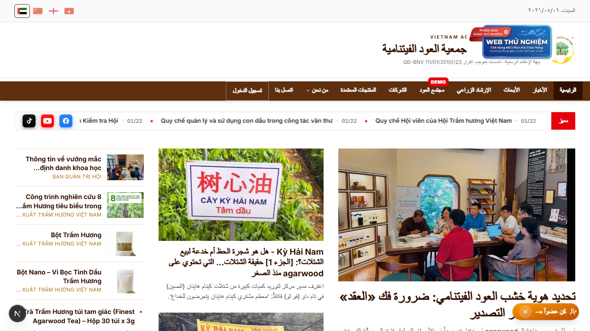

# 27. Đa ngôn ngữ + Editor 4 tab + AI dịch

## Mục đích
Hệ thống hỗ trợ 4 ngôn ngữ: **Tiếng Việt (vi) — mặc định**, **English (en)**, **简体中文 (zh)**, **العربية (ar)**. Cả static text (i18n messages) lẫn dynamic content (DB) đều dịch được. Admin nhập bản dịch qua editor 4 tab + nút **"AI dịch"** tự động dịch từ VI sang EN/ZH/AR.

## Đối tượng
- End-user: chuyển ngôn ngữ qua dropdown ở góc phải utility strip.
- Admin: nhập bản dịch.

## Public — chuyển ngôn ngữ
- **URL có locale prefix** (chỉ trên route public/auth): `/vi/...`, `/en/...`, `/zh/...`, `/ar/...`.
- **Cookie `NEXT_LOCALE`** lưu lựa chọn → kế tiếp tự load đúng ngôn ngữ.
- Internal route (`/admin`, `/tong-quan`...) **không có locale prefix** — vẫn render UI translated theo cookie.
- RTL (Arabic) tự động đảo layout (`dir="rtl"` trên `<html>`).

## Static text (next-intl)

### Cấu trúc
```
messages/
├── vi.json    ← nguồn chính
├── en.json
├── zh.json
└── ar.json
```

### Dùng trong code
```tsx
const t = useTranslations("homepage")
return <h1>{t("title")}</h1>
```

### Quy ước
- Key tổ chức theo namespace: `homepage.title`, `auth.loginTitle`, `navbar.home`...
- Khi thêm 1 key vi.json → cập nhật **đồng thời** 3 file còn lại (hoặc dùng nút AI dịch cho admin, xem dưới).

## Dynamic content (DB)

Mỗi field text có 4 cột song song:
```ts
title: string         // VI (bắt buộc)
title_en: string?     // EN
title_zh: string?     // ZH
title_ar: string?     // AR
```

Áp dụng cho: `News.title`, `News.excerpt`, `News.body`, `Company.name`, `Company.description`, `Product.name`, `Product.description`, `Leader.name`, `Leader.title`, `Leader.bio`, `User.bio`, `Post.title`, `Post.body`, etc.

### Helper `localize()`
```ts
import { localize } from "@/i18n/localize"

const text = localize(record, "title", locale)
// Trả về:
//   record.title_<locale> nếu có
//   record.title (VI) nếu không
```

→ Locale fallback: `<locale>` → `vi` (luôn có).

## Admin — editor 4 tab

Mọi field đa ngôn ngữ đều có 4 tab `[VI] [EN] [中文] [AR]` ở góc phải label. Click tab để switch giữa các bản dịch.

Hiển thị ở:
- `/admin/tin-tuc/[id]` — News.title, News.excerpt, News.body
- `/admin/banner` — Banner.title, Banner.subtitle
- `/admin/ban-lanh-dao` — Leader.name, Leader.title, Leader.bio
- `/admin/cai-dat` (Static texts) — bất kỳ key i18n nào không thuộc news/admin
- `/doanh-nghiep/chinh-sua` — Company.name, Company.description (cũng cho user owner)
- Tab "Thông tin cá nhân" của `/ho-so` — User.bio (cho hội viên)
- ... và nhiều form khác.

## Nút "AI dịch"

### Hành vi
- Bên cạnh tab EN/ZH/AR có nút **"AI dịch (ngôn ngữ trống)"** hoặc **"Dịch từ VI"**.
- Click → gọi `POST /api/admin/ai/translate` với:
  - `targetLocale`: en/zh/ar
  - `fields`: object các field VI cần dịch
- Server gọi **Gemini API** (qua `lib/gemini-models.ts`) với prompt chuyên ngành trầm hương:
  - Giữ nguyên HTML tags + URL ảnh + URL link.
  - Giữ tên riêng (Khánh Hòa, Quảng Nam, brand names).
  - Đảm bảo thuật ngữ nhất quán: `trầm hương → agarwood`, `kỳ nam → kynam`, `tinh dầu → essential oil`...
- Trả về JSON cùng key với input → tự điền vào các field tab tương ứng.
- Admin có thể tinh chỉnh thủ công sau dịch.

### Giới hạn
- Tối đa **20 fields** mỗi lần dịch.
- Tối đa **120.000 ký tự** mỗi request.
- Quyền: chỉ user có `news:write` permission (Admin / Infinite / Ban Thư ký / Ban Truyền thông).

### Fallback
- Lỗi Gemini hoặc rate-limited → trả lỗi 503 với message; admin nhập tay.

## Hiển thị fallback chain
- User chọn `en` → mở bài có `title_en = null` → fallback hiển thị `title` (VI).
- KHÔNG hiển thị máy dịch realtime — phải có bản dịch DB hoặc fallback VI.

## RTL (Arabic)
- `<html dir="rtl">` khi locale = ar.
- CSS đa số dùng logical properties (`ms-`, `me-`, `ps-`, `pe-` thay vì `ml-`, `mr-`...) → tự đảo.
- Một số chỗ phải custom (vd icon mũi tên) — kiểm tra thủ công khi build feature mới.

## Hình ảnh minh họa

**Trang chủ — Tiếng Việt**



**Trang chủ — English**



**Trang chủ — 中文**



**Trang chủ — العربية (RTL)**


